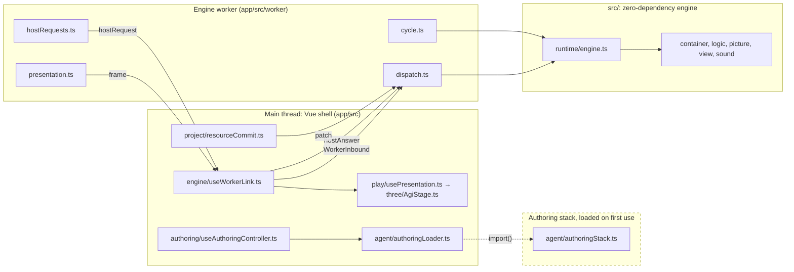

# Contributing

Thanks for helping. Contributions are welcome across the project: interpreter
fidelity, the authoring tools, the browser app, original adventures and the
documentation.

[AGENTS.md](AGENTS.md) holds the working agreements for everyone who changes
the code, people and coding agents alike: code conventions, architecture
boundaries, the verification method and the provenance rules. Read it before
your first change. Hosting and production releases are covered in
[docs/hosting.md](docs/hosting.md).

## Development

Install Node.js 22.22 or newer, then:

```bash
npm ci
npm --prefix app ci
npm run dev
```

The app opens at `http://localhost:5199/` with the manual editors ready to use.
`npm --prefix app run dev -- --mode test --port 5199` runs the same app with the
offline stub provider the browser tests use; to choose another port, pass
`-- --port N` to this app script. `AGI_DEV_KEYS=1 npm run dev` fills the AI
settings from `OPENAI_API_KEY` and `ANTHROPIC_API_KEY` in your environment for
browsers on this machine; keys already entered in Settings stay. Requests made
with these keys are billed to your provider account. The repository has two package roots: the root
holds the engine, tests and scripts, and `app/` the Vue shell. A third,
`evals/`, holds the evaluation runners; its own package adds only promptfoo,
which the live comparisons need (`npm --prefix evals install`). After switching
branches or pulling dependency updates, run `npm ci` in both; `npm run check`
verifies installed dependencies against both manifests before it tests anything.

For browser tests, install Chromium once with
`npm --prefix app exec -- playwright install chromium`, and WebKit too for the
phone and desktop WebKit suites. If your development
server is already running, give the browser tests their own port:
`AGI_E2E_PORT=5299 npm run test:e2e`.

### Commands

| Command                                                      | Purpose                                                                                                                                                           |
| ------------------------------------------------------------ | ----------------------------------------------------------------------------------------------------------------------------------------------------------------- |
| `npm run check`                                              | The gate: dependency check, typechecks, lint, ast-grep rules, knip and dependency-cruiser, the design-token ratchet, formatting, unit tests and stored eval cases |
| `npm test`                                                   | Engine tests                                                                                                                                                      |
| `node --test --experimental-strip-types test/<file>.test.ts` | One engine test file                                                                                                                                              |
| `npm run test:app`                                           | Browser adapter, worker, storage and provider transport tests                                                                                                     |
| `npm run test:e2e`                                           | Playwright scenarios against a dedicated test server                                                                                                              |
| `npm --prefix app run e2e -- e2e/<file>.spec.ts`             | One Playwright spec                                                                                                                                               |
| `npm --prefix app run e2e:webkit-desktop`                    | The desktop Studio scenarios tagged `@webkit-desktop`, in WebKit                                                                                                  |
| `npm run lint:ast`                                           | ast-grep structural rules and suppression check                                                                                                                   |
| `npm run eval:replay`                                        | Replay stored authoring failures without provider calls                                                                                                           |
| `npm run mutation`                                           | Stryker mutation report on `src/picture/` and `src/studio/`; on demand, writes `reports/mutation/`                                                                |
| `npm run build`                                              | Compile the engine and build the browser app                                                                                                                      |
| `npm run check:bundle`                                       | Bundle budget for startup, from Home to a catalog game's first frame, after a build                                                                               |
| `npm run media:capture`                                      | Recapture the README and `docs/media` images from the real app and agent tools; on demand, stub provider                                                          |

The full gate takes a few minutes. Playwright runs Vite in `test` mode with a
deterministic stub provider, so browser tests run offline. Live
model evaluations are described in [evals](evals/README.md). A paid run takes
both `--live` and `--budget-usd` on the command line (`EVAL_LIVE=1` and a budget
variable for the promptfoo lanes).

`npm run check:bundle` runs after `npm run build` and fails, in CI too, when the
compressed JavaScript, CSS or workers loaded from opening Home to a catalog
game's first frame outgrow their budgets. It measures Home, cold Play and the
Create shell separately and checks their module paths: the agent, debugger,
editors, WORDS analysis and SOUND previews load with their activities. Home
uses cached opening images; clicking Play loads and checks the catalog game.
Editor families load on first use. The agent loads when its panel opens or an
editor requests suggestions.
`app/e2e/lazy-authoring.spec.ts` walks the same path in a browser, on the
development server and on the production build. It checks which source modules
each requested script carries. Separately,
`app/e2e/perf-budgets.spec.ts` bounds boot long tasks and Studio frame and input
times. Its tests are tagged `@perf`: `npm --prefix app run e2e` leaves them out,
and `npm --prefix app run e2e:perf` runs them alone on one worker, so no other
test shares the machine they measure; CI runs them after the first of its four
Chromium shards. Change a budget only on purpose: edit it beside its measured
value and give the reason in the commit.

### Editor setup

Both package roots use TypeScript 6.0. In VS Code, choose **TypeScript: Select
TypeScript Version → Use Workspace Version** so editor diagnostics match the
gate. The root project checks the engine, tests and Node scripts; the app
solution references separate DOM and worker projects, including the Playwright
scenarios and the Vite and Playwright configs. `evals/tsconfig.json` checks the
evaluation configs, providers, assertions, prompts and regression tests under
the same strict rules. `npm run check` runs every TypeScript project;
JavaScript tooling has editor project coverage and is checked by lint and
runtime checks.

### Local logic language server

After `npm ci` at the repository root, a local LSP developer preview is available:

```bash
npm run --silent language-server -- --stdio
```

Configure an LSP client to launch this command from the repository and associate
AGI source files with language id `agi-logic`. Standard output is reserved for
protocol messages, so keep `--silent`. `--help` prints options to standard error.
The command runs locally over stdio.

The server uses the shared AGI compiler and language service for diagnostics,
completion, signature help, hover, same-document definitions and references, and
byte-preserving local rename proposals. It receives full document text with UTF-16
positions. Rename returns versioned edits for the client to apply.

The default interpreter profile is `2.936`; select another known profile with
`--profile ID`. Add `--words path/to/WORDS.TOK` for vocabulary completion and
`said()` compilation. Profile and dictionary inputs are fixed at startup; restart
after changing them. The preview analyzes source received from the client and
loads no project binding metadata or include files. Cross-document operations,
automatic file discovery and an editor marketplace extension are outside this
preview. It writes no files and does not connect to a running browser game.

`node --test --experimental-strip-types test/logic-lsp.test.ts` launches the actual
CLI through the official protocol client SDK. Editor-specific integrations should
be tested in their target client before claiming compatibility.

## Where things live

| Directory                                                                 | Responsibility                                                |
| ------------------------------------------------------------------------- | ------------------------------------------------------------- |
| `src/runtime/`                                                            | Interpreter, profiles, input, objects, sound timing and saves |
| `src/container/`, `src/logic/`, `src/picture/`, `src/view/`, `src/sound/` | AGI binary formats, compilers, readers and rendering          |
| `src/agent/`                                                              | Authoring tools, prompts, command help and isolated playtests |
| `src/studio/`, `app/src/studio/`                                          | Workspace editors, loaded on first use in Create              |
| `app/src/`                                                                | The browser app: Vue shell, engine worker, storage and ZIPs   |
| `games/`                                                                  | Original adventure briefs and the tutorial                    |
| `scripts/`                                                                | Walkthrough, audit, conformance and interpreter probe tools   |
| `test/`, `app/test/`, `app/e2e/`                                          | Engine, adapter and browser verification                      |
| `evals/`                                                                  | Stored bad cases, evaluation runners and benchmark results    |

The engine in `src/` has no runtime dependencies and runs unchanged in the
browser, a Web Worker and Node; platform access is injected through adapters.

The running Create project's `ProjectSession` owns the model, edit History and
autosave. A validated edit that needs a new execution boundary remains saved in
the model and History while MAIN runs the previous image. `pendingRestart` names
the reason and action; `restartWithChanges()` validates the complete current
image before replacing the Engine, and `reenterRoom()` admits it at the same
strict idle boundary as live edits before running real room-entry semantics.
Both publish the running identity only after worker acknowledgement. Re-entry
preserves global state through `new.room`; room LOGIC controls subsequent actor
placement and side effects. Each action opens a rewind segment with the admitted
image, retaining the preceding run and its queued recording batches.

Inside `app/src/`, `main.ts` mounts `App.vue`, the shell's root component, and
each folder holds one responsibility:

| Folder           | Responsibility                                                                          |
| ---------------- | --------------------------------------------------------------------------------------- |
| `engine/`        | The main thread's side of the engine: worker link, queries, lifecycle, `useEngine.ts`   |
| `worker/`        | The engine worker: its entry, the message protocol, dispatch, clock and host            |
| `play/`          | The Play screen: stage, keyboard and touch input, prompts and presentation              |
| `render/`        | Frame composition: the EGA palette, the 8×8 font and the 320×200 compositor             |
| `three/`         | GPU presentation and CRT effects                                                        |
| `audio/`         | Sound output on the main thread                                                         |
| `inspector/`     | The AGI inspector: its dock, overlay, coordinate mapping and layer picking              |
| `history/`       | The always-on recording, its storage and the transport bar under the stage              |
| `walkthrough/`   | Walkthrough playback and the replay driver the browser tests use                        |
| `saves/`         | A player's progress: save slots, autosaves and their thumbnails                         |
| `project/`       | The stored project: bodies, identities, metadata and the transactions every write takes |
| `archive/`       | ZIP formats: project archives, published games and `HISTORY.JSON`                       |
| `library/`       | The game library: imports, the hosted catalog, discovery, previews and profile choice   |
| `home/`          | The Home screen: the shelf, its cards and the create panel                              |
| `shell/`         | Page chrome, modes, commands, keyboard focus, Create docks, Settings, Help and routing  |
| `settings/`      | AI provider, model and key settings                                                     |
| `authoring/`     | The assistant's panels, the controller that runs AI turns, and recorded game tests      |
| `agent/`         | Provider sessions, conversation transport and worker bridge; the stack loads on AI use  |
| `references/`    | Reference art the player supplies for the agent to encode                               |
| `world/`         | The world map, its room graph and plan, and the Studio launchers                        |
| `studio/`        | Workspace editors, loaded on first use in Create                                        |
| `lessons/`       | Studio lessons tied to catalog releases                                                 |
| `ui/`, `styles/` | Base controls, design tokens and global stylesheets                                     |
| `types/`         | Ambient declarations                                                                    |

## How it fits together

Three boundaries carry every feature. The Vue shell on the main thread owns the
page; the engine worker owns the interpreter and its clock; the engine in
`src/` is plain TypeScript with no platform access. The AI authoring stack
loads on demand: `authoringLoader.ts` imports it on the first AI action.
The workspace debugger also loads on first use and attaches to MAIN. Its stop
holds project admission through steps; Continue releases queued edits at the
next safe boundary and rebinds the source maps and breakpoints. Isolated test
sessions remain helpers for offline tests.



**A keypress becomes a frame**

1. `App.vue` listens for `keydown` and hands it to `play/useGameKeys.ts`, which maps it to an AGI key code.
2. `play/useInputController.ts` posts `{ type: "key" }`, a `WorkerInbound` message (`worker/workerProtocol.ts`).
3. `worker/engine.worker.ts` passes it to `worker/dispatch.ts`, and `worker/input.ts` queues it.
4. `worker/cycle.ts` ticks at 60 Hz and calls `Engine.tick()` (`src/runtime/engine.ts`), which drains the queue through the host (`worker/host.ts`) into `src/runtime/inputQueue.ts` and runs logic 0.
5. `worker/presentation.ts` posts the screen as a `frame` message, transferring its buffers.
6. `engine/useWorkerLink.ts` receives it, and `play/usePresentation.ts` composites it (`render/composite.ts`) onto the GPU stage (`three/AgiStage.ts`).

**The agent writes a room**

1. `new.room` calls the `prepareRoom` host hook (`Engine.newRoom`); `worker/host.ts` asks for a room only in a game made in the app, and only when the room has no logic yet.
2. `worker/hostRequests.ts` posts a `hostRequest` and parks the interpreter; the worker keeps serving other messages.
3. `authoring/useAuthoringController.ts` loads the authoring stack and hands the request to `AgentSession` (`agent/agentSession.ts`), which forks the game state.
4. The provider conversation (`agent/llmClient.ts`) calls tools through `executeAgentToolAsync` (`src/agent/tools.ts`), which refuses any tool outside the session's allowlist.
5. Each tool validates what it writes: logic goes through the assembler (`src/logic/assembler.ts`), pictures and views through their compilers, and the `finish` tool runs the room's game tests.
6. The gate: `turnBaseGuard` (`authoring/useAuthoringController.ts`) records the revision the turn builds on, and `requireSaved` (`project/projectTransaction.ts`) refuses the turn before it spends and again before its room lands if the stored project moved on.
7. `prepareRoomPatch` (`src/agent/roomPatch.ts`) checks the room as a whole, the answer returns in `hostAnswer`, and the worker checks it again before `Engine.patchResources` resumes `new.room`.
8. For an owned project, the controller validates the complete candidate through `ProjectSession`. After the room answer resumes the worker, `mainProjectAdmission.ts` verifies the exact landed resource revision before recording one History commit and saving the background task chat. Detached compatibility services retain `writeOverSaved` and `confirmSaved`.

**A Room Studio edit becomes bytes**

1. `useStudioDocument.ts` opens the picture as annotated source (`src/studio/pictureDocument.ts`): items are comment blocks, so annotations leave the bytes unchanged.
2. A gesture on `StudioCanvas.vue` reaches `useStudioInput.ts` and then `useStudioDrag.ts`, `useStudioEditing.ts` or `useStudioTools.ts`.
3. `useStudioDraft.ts` applies it as an edit operation (`src/studio/editOperations.ts`), which rewrites the source; several selected items take a batch (`applyEdits`), checked and undone as one edit.
4. `compileEditDocument` (`src/studio/editValidation.ts`) compiles the source to bytes and decoded planes.
5. `checkStudioEdit` (`studioLocks.ts`) checks the decoded pixels against the lens's locks (`validateEdit` in `editValidation.ts`, and the Walk lens depth rule in `lensRules.ts`). What an accepted edit changes in other items' output, such as a fill that pours differently around a moved outline, is reported as a side effect (`src/studio/sideEffects.ts`), not refused; AI proposals report theirs the same way.
6. A completed gesture emits its edited document to `studio/workspace/CreateWorkspace.vue`. `project/projectSession.ts` validates the complete candidate, admits it to MAIN at a safe boundary, records History and saves it conditionally. The embedded editor previews a gesture locally until it completes.

**An image becomes project art**

`src/creative/imageOperations.ts` supplies the same pure proposals for editors
and tools: `traceImageChanges` attaches immutable originals and normalized
pixels, and `makeCelsChanges` appends prepared native VIEW cels. Submit the whole
proposal through `ProjectSession` to share autosave, Undo, Redo and History.
PICTURE tracing blends above art by default; its optional `behindArt` field and
opacity persist with the reference. The editor keeps its normal canvas layout.
Attachments use SHA-256 document keys and History's blob store. Private archive
version 1 writes each image blob once in `ATTACHMENTS/`, shared by the workspace
and History; public exports contain playable resources. Workspace and History
version 1 include image documents, game notes and chat checkpoints.
The image panel and generation controller load at their first use. Generation
reviews a paid request before submission. Hero preview changes presentation
pixels; interpreter state and recorded play retain the admitted game.
`src/creative/imageOperations.ts` detects alpha or corner-colour backgrounds,
boxes connected figures across sheet gaps and derives cel width from one height.
`src/creative/imageFrameGeometry.ts` owns pixel snapping, bounded drawing,
linked edge resizing, unlinking, ordering and loop assignment. The sheet editor
asks before replacing edited boxes and renders thumbnails from prepared cels.
The marks stay local until Add cels submits one proposal. Editing a mirror loop gives it independent cels while
preserving its displayed frames.

**A LOGIC edit becomes a saved project**

Library **Game actions → Create** opens the running workspace on a LOGIC.
`studio/workspace/LogicEditor.vue` retains Monaco models and their view state,
with code intelligence from the analysis worker. `workspaceWrites.ts` coalesces
typing bursts and serializes completed gestures. `ProjectSession` stores invalid
source alongside the last admissible build, so the game continues while errors
are fixed. Every editor shares its Undo, Redo, History and autosave owner.

**Where authority lives.** Each of these is a check in code:

- `AUTHORING_TOOL_NAMES`, `ASK_TOOLS` and `STUDIO_ASSIST_TASK_TOOLS` in `src/agent/tools.ts` are allowlists: a tool outside the list is refused before dispatch.
- `prepareRoomPatch` accepts a room only if it is whole: it parses every payload under the game's profile, lets the vocabulary only grow, and stages the result on a copy.
- `editValidation.ts` checks Studio gestures by their decoded pixels. Workspace agent changes use `projectAgentCandidate.ts` to validate complete coordinated documents and native resources; `assistScope.ts` remains in detached Studio compatibility services.
- `project/projectTransaction.ts` owns saved, installed and current: the base an edit was made from, what storage holds, and what the running game confirmed it installed. Every project write (an editor change, an AI turn, a room written mid-play, an autosave) is refused as stale unless storage still holds its base, and only an acknowledged install moves the booted game forward.
- `project/projectSession.ts` owns Create’s current documents, diagnostics, live admission, autosave and History. Every workspace editor and agent change submits through it. Review selects a validated coordinated change set; Auto-approve records each valid proposal immediately. Chat checkpoints identify the change and its preceding History commit.
- `project/resourceCommit.ts` and `project/editableProject.ts` retain the compatibility and detached authoring services exercised by their unit tests.
- The logic assembler and the container writer are the validators of last resort.

Two words carry more than one meaning. `prepareRoom` is the engine's host hook,
`AgentSession.prepareRoom` is the turn that answers it, and `prepareRoomPatch`
is the check on that answer. The known-games catalog (`src/games/knownGames.ts`)
fingerprints releases, while the Home shelf (`app/src/library/gameCatalog.ts` and a
host's `catalog.json`) lists games to play.

**Project storage and archives.** Stored bodies, the localStorage index and
private `PROJECT.JSON` archives retain released version 1. Assistant fields keep
their original top-level layout and are optional for manually authored games.
Optional `workspace`, `projectHistory`, `chats` and `recoveryDraft` fields carry
source documents, edit History, task conversations and unfinished detached draft
state. Workspace and project History are version 1. Missing optional fields read
as their original absence; unknown versions refuse without rewriting data.
Chats contain transcripts and messages, with model handoffs summarized into a
continuing conversation. Public game exports contain playable resources.
Private backups preserve the stored playable files byte for byte; public Game
exports still synthesize an empty `OBJECT` when a game lacks one.

Playback recordings use version 2 for debugger boundaries and complete project
admission events. Released version-1 tapes remain unchanged on read; the first
committed append upgrades their recording header atomically. The archive and
storage wrappers remain version 1. Engine replay state, authentic save files and
recorded game tests retain their existing contracts.

The IndexedDB database uses schema version 2 to fence older application writers
from the coordinated project/History transactions. Opening a released schema-1
database preserves its records. This database gate is separate from the body
and index codecs. The workspace codec stores text and bytes exactly without
compiling them; recompile documents against their resource revision to establish
that sources reproduce playable bytes, as `app/src/project/localProject.ts` does
at creation.

### Extending

| Task                                 | Files                                                                                                                                                                                                                                                          | Test                                                                                                                    | Gate                                   |
| ------------------------------------ | -------------------------------------------------------------------------------------------------------------------------------------------------------------------------------------------------------------------------------------------------------------- | ----------------------------------------------------------------------------------------------------------------------- | -------------------------------------- |
| An agent tool                        | Its definition in the family's module (`src/agent/roomTools.ts`, `pictureTools.ts`, `authoringToolDefinitions.ts`, …), gathered into `AGENT_TOOLS` in `src/agent/tools.ts`; add it to `ASK_TOOLS` or `STUDIO_ASSIST_TASK_TOOLS` only if those sessions need it | `test/agent-tools.test.ts` or the family's test; a failure it must reject as a JSON case in `evals/fixtures/bad-cases/` | `npm run eval:replay`, `npm run check` |
| An interpreter quirk for one profile | A flag on the profile in `src/runtime/profile.ts`, its behavior in `src/runtime/`, and an entry in `docs/fidelity.md` with build, binary hash, addresses and conclusion                                                                                        | A hand-computed engine test under `test/`; the code comment cites the entry, checked by `test/doc-citations.test.ts`    | `npm test`, `npm run check`            |
| A fan game the app recognises        | A `KNOWN_GAMES` entry in `src/games/knownGames.ts`: the SHA-256 of its `WORDS.TOK` and `OBJECT`, its era and profile                                                                                                                                           | `app/test/known-games.test.ts`; `npm run fixtures:audit` on your copy in `games/`, where fixture tests skip without it  | `npm run check`                        |
| A Room Studio tool                   | `StudioTool` and `TOOL_SHORTCUTS` in `app/src/studio/studioTools.ts`, a rail entry in `StudioToolRail.vue`, its name, status-bar hint and cheat-sheet line in `studioHelp.ts`, handling in `useStudioTools.ts`                                                 | `app/test/studio-tools.test.ts`; `app/e2e/studio-tools.spec.ts` for the visible path                                    | `npm run check`, the spec              |

TypeScript holds the Studio recipe together: a tool without a shortcut or help
text does not compile, the rail reads its shortcut from `TOOL_SHORTCUTS`, and
`studio-tools.test.ts` fails when two tools share a letter. A new edit
operation goes in `src/studio/editOperations.ts` with a test in
`test/studio-edit-operations.test.ts`; the Studio's validators check it like any
other edit.

## Design system

The app styles itself from `app/src/styles/tokens.css`: colours, font sizes,
spacing and radii are tokens, and the base controls (buttons, dialogs, chips,
icon buttons) live in `app/src/ui/`. `npm run lint:tokens` is a ratchet that
fails on new raw colours, font sizes and radii outside the tokens file, so
new chrome should reach for a token or a `ui/` component first.
`app/ui-gallery.html` and `app/studio-harness.html` are dev/test-only pages —
run `npm run dev`, then open `/ui-gallery.html` or `/studio-harness.html`.

## Interpreter behavior

The engine implements Peter Kelly's
[AGI behavioral specification](https://peterkelly.github.io/agi-re/spec/).
Before implementing an opcode, read the common contract and the variants for the
selected interpreter profile.

When a game depends on behavior the specification leaves open, or builds
disagree, the original interpreter is the reference.
[Interpreter compatibility](docs/fidelity.md) collects what is known and how it
was established; its appendices describe the tooling for inventorying, decoding,
disassembling and probing an interpreter you supply locally. Record a new
finding there with its build, binary hash, addresses and conclusion, label facts
and inferences, and cite the entry's heading from code comments; the offsets
stay in the entry. Keep decoded binaries and disassembly with your local
fixtures, outside the repository.

## Tests

A behavior change comes with the cheapest test that proves it: exact bytes,
pixels or structure first. Watch a new test fail once before making it pass.
Documentation-only changes need consistency and formatting checks.

- Engine regressions use small, original resources with hand-computed
  expectations.
- Worker behavior gets a unit test under `app/test/` that drives the worker
  modules with fake ports and a real `Engine`; a Playwright spec covers only the
  user-visible behavior. Tests that mirror the implementation or duplicate
  another assertion are not kept.
- Compatibility suites also run against game files you supply in
  `games/<folder>/`. Those folders are ignored by git and excluded from
  production builds, and missing inputs produce explicit test skips.

[Testing](docs/testing.md) covers game fixtures, walkthrough proofs, browser
replay, reference comparisons and recorded game tests.
[Adding a walkthrough test](docs/testing.md#adding-a-walkthrough-test) explains
how to contribute a reproducible route with milestone assertions.

## Reporting bugs

Open an [issue](https://github.com/monotio/agi/issues) with the expected
behavior, what happened, and the smallest steps that reproduce it. Include the
application version or commit and your browser; for compatibility bugs, include
the game edition and interpreter profile. Prefer an original minimal resource
or input sequence that another contributor can run without commercial game
files.

## Pull requests

Describe the player-visible result or developer capability, then how you
validated it. Include the interpreter profile for compatibility changes. Update
the public docs when behavior changes, and credit any external specification or
asset. Contribute only code and assets you have the right to distribute under
the project's license; commercial game data belongs in local fixtures.
