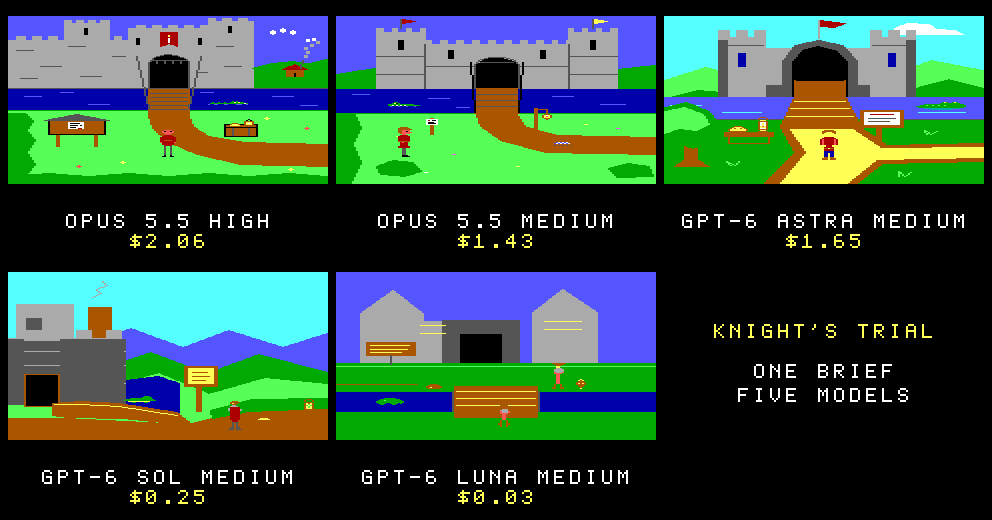
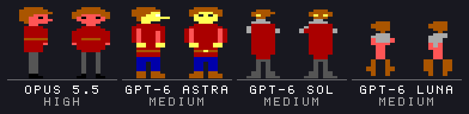
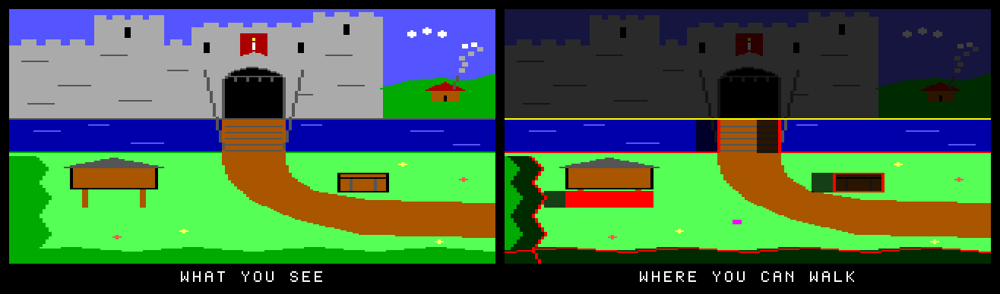

# AGI IS HERE

AGI is here, and it runs in your browser. It understands commands like LOOK AT
CASTLE, it draws in sixteen colours, and if you ask, it will put an alligator
in the moat while you are standing next to it.

This AGI is Sierra's
[Adventure Game Interpreter](https://en.wikipedia.org/wiki/Adventure_Game_Interpreter),
the engine behind King's Quest, Space Quest and Leisure Suit Larry, rebuilt
from scratch and paired with an AI co-author. Play the classics from your own
copies, or describe a new adventure and play it while an agent builds the world
around you. Ask for changes mid-game: give the guard a different personality,
add a puzzle, or turn the courtyard into a swamp. Everything the agent makes is
a real AGI game that you can inspect, download and play again.



_One brief, five models. Each castle is a real AGI picture drawn in vector
commands, with a working moat, a hero and a game behind it, for between three
cents and two dollars. From the [Genesis benchmark](evals/benchmarks/genesis/1.0.0/README.md)._

## Try it

Open [agi.monotio.com](https://agi.monotio.com/) and click **Play now** on
**Adventure Department**, a three-room tutorial about how these games are made:
you repair a picture, wake up a sprite and sort out a clerk's priority. You need
no account, no API key and no Sierra files.


- **Play your own Sierra games.** **Add game** takes a ZIP or a game folder.
  The files stay in your browser's storage and are never uploaded. The app
  recognises the edition, picks the matching interpreter and checks that the
  game opens.
- **Watch a playthrough.** Verified releases come with a recorded completion
  that replays on the real interpreter, keystroke by keystroke, on the game's
  own clock. Pause it, scrub the timeline, or **Take control** whenever you
  like.
- **Rewind.** Every session records itself, so you can go back to any earlier
  moment and carry on from there.
- **Get help.** **Help** is a short guide to playing, creating and managing your
  games, open from every screen. Each topic can open the control it describes.

## The games it plays

These editions are verified in this interpreter. The PC editions are checked
with recorded walkthroughs; the Amiga and Apple IIgs editions boot into their
first room under their own interpreters.

| Game                       | PC (DOS) | Amiga | Apple IIgs | Recorded walkthrough |
| -------------------------- | :------: | :---: | :--------: | -------------------- |
| King's Quest I             |   Yes    |       |            | Full game            |
| King's Quest II            |   Yes    |  Yes  |            | Full game            |
| King's Quest III           |   Yes    |       |            | Full game            |
| King's Quest IV            |   Yes    |       |            | Full game            |
| Space Quest I              |   Yes    |  Yes  |            | Full game            |
| Space Quest II             |   Yes    |  Yes  |    Yes     | Full game            |
| Police Quest I             |   Yes    |  Yes  |            | Full game            |
| Leisure Suit Larry I       |   Yes    |       |            | Full game            |
| The Black Cauldron         |   Yes    |       |            | Full game            |
| Mixed-Up Mother Goose      |   Yes    |       |            | Full game            |
| Donald Duck's Playground   |   Yes    |       |            | One chapter          |
| Gold Rush!                 |   Yes    |  Yes  |            | Full game            |
| Manhunter: New York        |   Yes    |       |            | Full game            |
| Manhunter 2: San Francisco |   Yes    |  Yes  |            | Full game            |
| Sierra AGI demo pack 4     |   Yes    |       |            |                      |

A few things worth knowing:

- **Walkthroughs** are recorded on the PC editions and tied to the exact release
  they were captured on. The
  [KQ1 completion proof](docs/testing.md#kq1-completion-proof) shows how one is
  made and checked.
- **Sound** follows the machine. Amiga editions play through emulated Paula,
  the IIgs edition through its own Ensoniq wavetable instruments read from the
  game's files, and PC editions through the Tandy sound chip or the PC speaker,
  under **Settings → Advanced… → Sound chip**.
- **Mouse** clicks walk the hero on the Amiga and IIgs editions, as they did on
  the originals.
- **The picture** fills a 4:3 frame, the way a monitor of the day stretched the
  320 × 200 screen. **Settings → Original 4:3** turns that off for square
  pixels.
- **Text** uses this project's own 8 × 8 font in the original character grid,
  not each machine's built-in font. It covers English text and the box drawing
  the Sierra games print; other characters show blank.
- **Fan-made games** run too. If the app cannot tell which interpreter a game
  needs, it asks. [Testing](docs/testing.md#testing-compatibility) lists the
  exact editions and builds.

Commercial games are not included: bring your own copies, and they stay in your
browser. No copies? Fans have made over a hundred free AGI games since the late
nineties, collected on the
[AGI Wiki's fan release list](https://agiwiki.sierrahelp.com/index.php/Fan_AGI_Release_List)
and in the
[SCI Programming community's game list](https://sciprogramming.com/fangames.php?eng=agi&cat=Complete&sort=downloads).
Their content varies, as fan works do.

## Make your own adventure

Pick a template or describe your own hero, setting and trouble, connect an
OpenAI or Anthropic API key, and click **Create adventure**.

| Template                                                | Your predicament                                                     |
| ------------------------------------------------------- | -------------------------------------------------------------------- |
| [Knight's Trial](games/knights-trial/SKILL.md)          | Find three impossible treasures before the kingdom runs out of time. |
| [Badge of Millhaven](games/badge-of-millhaven/SKILL.md) | A rookie cop discovers that procedure is easier to follow on paper.  |
| [Mop Jockey](games/mop-jockey/SKILL.md)                 | The station needs a hero. It has sent the cleaner.                   |
| [Polyester Nights](games/polyester-nights/SKILL.md)     | A middle-aged lounge lizard tries his luck for one more night.       |

The agent plans the world and builds the opening room: artwork, characters and
game logic. When you walk into a room that does not exist yet, play pauses
while the agent writes it. Along the way you can:

- plan on the world map in Create's World panel: rename rooms, edit their
  briefs and pin notes the agent reads when it builds that part of the world;
- use **Ask** in Play for hints and questions that leave the game untouched,
  or **Remix** in Create to change it, including any game you imported;
- attach reference images for rooms and character sprites;
- preview the game's sounds as WAV clips.

A running game has two modes, switched in the top bar: **Play** is the game as
its players see it, and **Create** docks the tools around it — the world map
and its rooms on the left, the assistant on the right. Create also opens
**Room Studio** on a room's picture: art, depth and walk lenses, a draw-order
scrubber and a pixel inspector that names the command behind any pixel. In
this release Studio is view-only.

Everything the agent writes is a standard AGI resource: logic, vector pictures,
animated sprites, vocabulary, inventory and sound. The heroes above walk because
the agent drew each frame of each direction, then compiled them into the same
kind of view file Sierra's artists made:



An AGI room is also more than its picture. Behind it the game keeps a second,
invisible layer: how far away each part of the scene is, and where the hero may
and may not walk. The agent paints that layer too, so the knight walks around
the notice board and the chest, stops at the water's edge and crosses by the
drawbridge:



The agent checks its own work with rendered previews, compiler messages and
playtests of its own. It can still get art, puzzles or writing wrong, so play
it, and ask for revisions when something is off.

**Your key, your provider, no server.** The app talks to your provider directly
from the browser. Your key is saved in browser storage and sent only to the
provider you choose, along with the game content each request needs. Requests
are billed to your account; each task starts with an estimated $5 budget that
you can change. What the agent writes comes from your provider's model and is
not reviewed by the app, so play a game through before you share it, especially
with children. [Security](SECURITY.md) covers storage and data flow, and
[adventure briefs](games/README.md) covers writing your own templates.

## Save and share

Games, saves and history live in your browser. The game's own Save and Restore
use the authentic AGI save format, with twelve named slots per game, and the
app saves as you play, so **Resume** picks up where you left off.

| Settings → This game | What you get                                                                                                                                               |
| -------------------- | ---------------------------------------------------------------------------------------------------------------------------------------------------------- |
| **Export game…**     | A ZIP of the playable resources and public metadata: description, author, license and remix provenance.                                                    |
| **Download game…**   | A ZIP of the game plus its authoring conversation, images, source descriptions, world notes, stored tests, map, session history, saved games and autosave. |

Either ZIP opens again with **Add game**, in any browser. A game without a
declared license keeps an unknown license: exports never inherit this
repository's MIT license.

## Thirty years later

Around 1996, **Lance Ewing, Peter Kelly, Martin Tillenius** and I worked on
**MEKA**, an early fan-made AGI interpreter. I was **Joakim Möller** then. We
traded discoveries about how Sierra's adventures worked.

On 3 September 2026, Greg Brockman closed an OpenAI briefing with
[“Welcome to the AGI era.”](https://www.axios.com/2026/09/03/openai-astra-gpt-6-agi-brockman)
I took him at his word. With OpenAI's
[GPT-6 Astra](https://developers.openai.com/api/docs/models/gpt-6-astra) in
Codex, I went back to AGI to rebuild the engine, and to let an agent change the
game while I was playing it. Now I can ask for an alligator in the moat, and the
agent rewrites the game's own bytecode to put it there. Thirty years on, that is
still a very cool thing to be able to do.

**Peter Kelly's [agi-re behavioral specification](https://peterkelly.github.io/agi-re/spec/)
is the foundation of this independent implementation.** It documents the
formats, observable behavior and interpreter versions, and is published under
[CC0](https://github.com/peterkelly/agi-re/blob/main/LICENSE). Thank you, Peter.

## As close to the originals as we could get

Every Sierra AGI game shipped with its own build of the interpreter, and the
builds do not quite agree. On a PC, a wandering guard whose countdown runs out
walks 256 more steps before he turns; on an Amiga he turns every 7 to 51
steps. Details like that decide whether a puzzle is fair, so the engine keeps
them.

It starts from Peter Kelly's CC0
[agi-re specification](https://peterkelly.github.io/agi-re/spec/), a clean-room
description of how AGI behaves. Where a game needs more than the specification
says, or where builds disagree, the original interpreter's machine code was read
and often run in isolation with controlled inputs, on PC builds from 2.089 to
3.002.149 and on the Amiga and Apple IIgs interpreters. The random-number
generator alone was executed from ten original executables for all 65,536 of
its states. Each finding is written down with its evidence and held in place by
a regression test, and full-game walkthroughs of thirteen games replay on the
engine keystroke by keystroke. [Interpreter compatibility](docs/fidelity.md)
tells the whole story, from that random-number generator to the Amiga sound
driver.

Under the hood, the engine is a TypeScript AGI interpreter with no framework
and no runtime dependencies. It reads AGI v2 and v3 game files, including the
Amiga and Apple IIgs layouts, and picks each build's behaviour through
interpreter profiles. Games made in the app are standard AGI 2.936 bytecode
with no custom opcodes. The engine runs in a Web Worker; the Vue shell adds a
GPU-rendered CRT display and an in-game command line, while game text stays on
the original 40 × 25 character screen.

## Run it yourself

Install Node.js 22.22 or newer, then:

```bash
npm ci
npm --prefix app ci
npm run dev
```

Open `http://localhost:5199/`. The site needs a connection to load; it is not
an installable offline app yet. Exported games play offline in any compatible
interpreter.

| Document                                                | For                                                             |
| ------------------------------------------------------- | --------------------------------------------------------------- |
| [Interpreter compatibility](docs/fidelity.md)           | How the original interpreters behave and how the engine matches |
| [Contributing](CONTRIBUTING.md)                         | Development setup, checks and pull requests                     |
| [Testing](docs/testing.md)                              | Game fixtures, walkthrough proofs and compatibility checks      |
| [Hosting](docs/hosting.md#including-games-on-your-site) | Running your own copy and adding games to its catalog           |
| [Evals](evals/README.md)                                | Measuring authoring quality                                     |
| [Media gallery](docs/media/README.md)                   | Screenshots of the agent's tools and the tutorial               |
| [Security](SECURITY.md)                                 | Keys, storage and data flow                                     |

## License

Created by Joakim Riedel and published by [Monotio](https://monotio.com). The
engine, authoring tools, browser shell and original project assets, including
the Adventure Department tutorial, use the [MIT license](LICENSE).
Dependencies and imported games keep their own licenses; no commercial game
assets are part of this repository. The pencil, menu and chevron icons are from
[Lucide](https://lucide.dev), with
[ISC and Feather MIT notices](app/public/licenses/lucide.txt) included in the
build.
