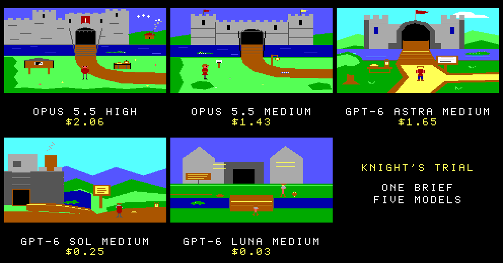
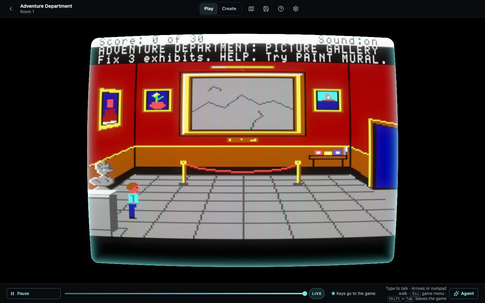
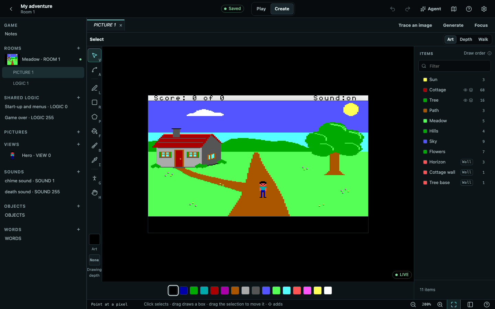
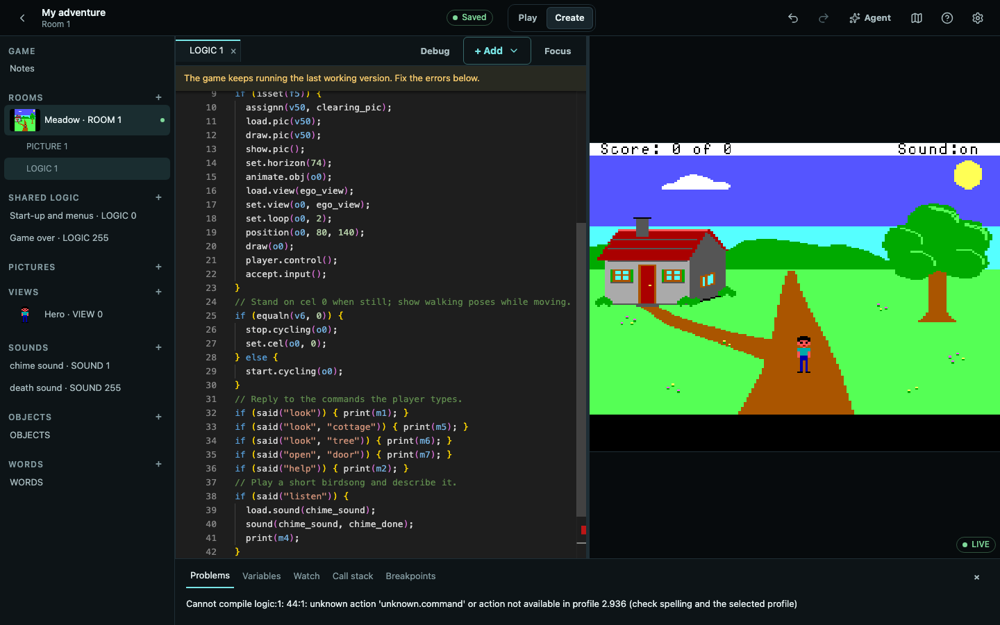
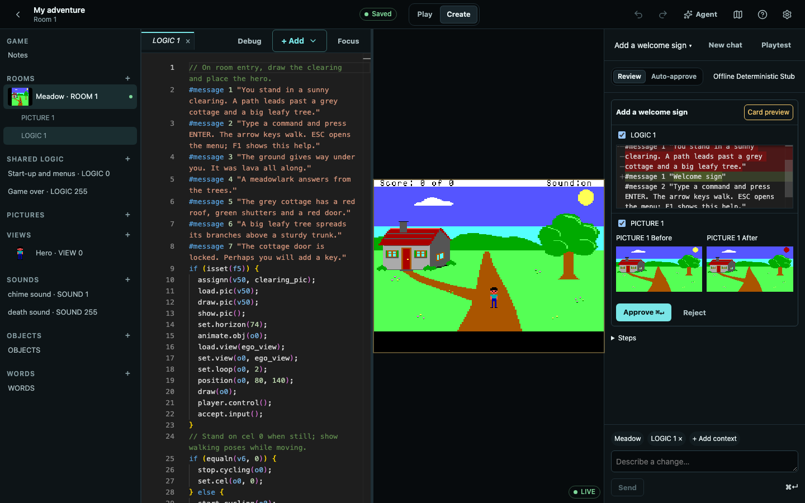
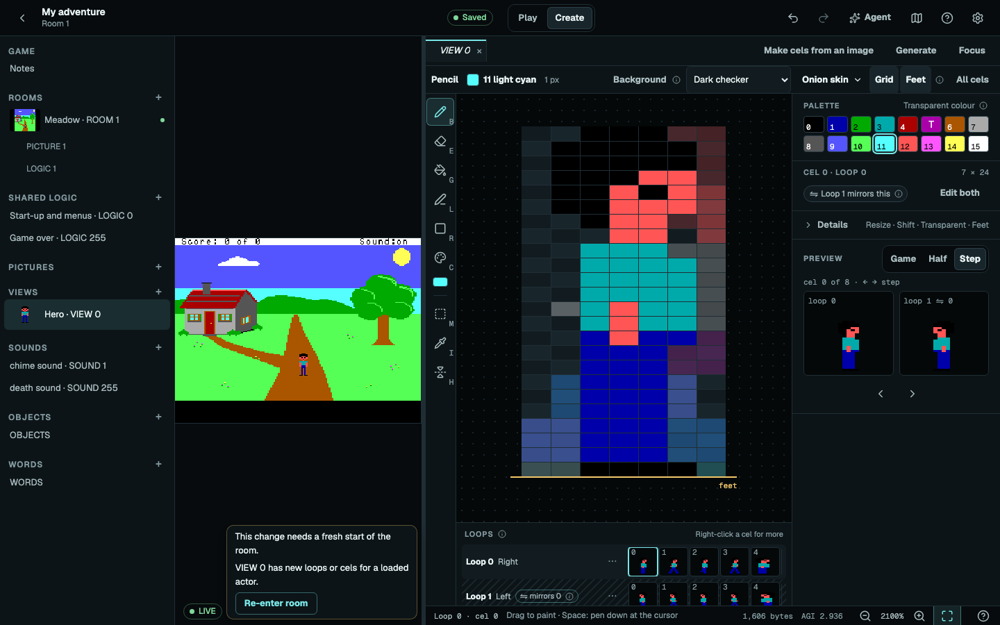
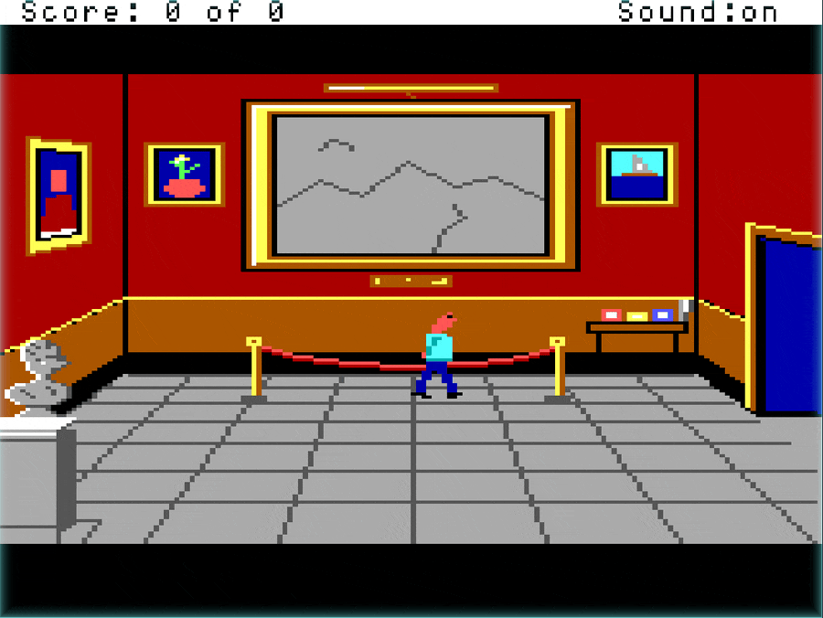

# AGI IS HERE

AGI is here, and it runs in your browser. It understands commands like LOOK AT CASTLE, it draws in
sixteen colours, and if you ask, it will put an alligator in the moat while you are standing next to
it.

This AGI is Sierra's
[Adventure Game Interpreter](https://en.wikipedia.org/wiki/Adventure_Game_Interpreter), the engine
behind King's Quest, Space Quest and Leisure Suit Larry, rebuilt from scratch. Play the classics
from your own copies, build a game by hand, or describe an adventure and play it while an AI agent
builds the world around you. Everything you make is a real AGI game that you can inspect, download
and play again.



_One brief, five models. Each castle is a real AGI picture drawn in vector commands, with a working
moat, a hero and a game behind it, for between three cents and two dollars. From the
[Genesis benchmark](evals/benchmarks/genesis/1.0.0/README.md)._

## Try it

Open [agi.monotio.com](https://agi.monotio.com/) and choose **Play the tutorial**. **Adventure
Department** is a three-room tutorial about how these games are made: you repair a picture, wake up
an actor and sort out a clerk's Depth.



- **Play your own Sierra games.** **Add game** takes a game folder, a ZIP or its disk images; add
  all disks of a game together. The files stay in your browser, and the app picks the matching
  interpreter for the edition.
- **Watch a walkthrough.** Verified releases replay a recorded completion on the real interpreter.
  Pause it, scrub the timeline, or **Take control**.
- **Rewind.** Every session records itself, so you can return to any earlier moment and carry on
  from there.
- **Get help.** **Help** on the home screen and in a running game explains playing, creating and
  managing games.

## The games it plays

These editions are verified in this interpreter. The PC editions are checked with recorded
walkthroughs; the Amiga and Apple IIgs editions boot into their first room under their own
interpreters.

| Game                       | PC (DOS) | Amiga | Apple IIgs | Recorded walkthrough |
| -------------------------- | :------: | :---: | :--------: | -------------------- |
| King's Quest I             |   Yes    |       |            | Full game            |
| King's Quest II            |   Yes    |  Yes  |            | Full game            |
| King's Quest III           |   Yes    |       |            | Full game            |
| King's Quest IV            |   Yes    |       |            | Full game            |
| Space Quest I              |   Yes    |  Yes  |            | Full game            |
| Space Quest II             |   Yes    |  Yes  |    Yes     | Full game            |
| Police Quest I             |   Yes    |  Yes  |            | Full game            |
| Leisure Suit Larry I       |   Yes    |       |            | Full game            |
| The Black Cauldron         |   Yes    |       |            | Full game            |
| Mixed-Up Mother Goose      |   Yes    |       |            | Full game            |
| Donald Duck's Playground   |   Yes    |       |            | One chapter          |
| Gold Rush!                 |   Yes    |  Yes  |            | Full game            |
| Manhunter: New York        |   Yes    |       |            | Full game            |
| Manhunter 2: San Francisco |   Yes    |  Yes  |            | Full game            |
| Sierra AGI demo pack 4     |   Yes    |       |            |                      |

Sound follows the machine: emulated Paula on the Amiga, Ensoniq wavetable on the IIgs, and the Tandy
chip or PC speaker on a PC. **Settings → Advanced… → Sound chip** picks the PC one. The picture
fills a 4:3 frame like a monitor of the day; **Settings → Original 4:3** switches to square pixels.
Mouse clicks walk the hero on the Amiga and IIgs, as they did on the originals. Text uses this
project's own 8 × 8 font, which covers English and the box drawing Sierra's games print. Fan-made
games run too. [Testing compatibility](docs/testing.md#testing-compatibility) lists the exact
editions, disk-image formats and builds.

Bring your own copies of commercial games. Fans have also made over a hundred free AGI games since
the late nineties. Find them on the
[AGI Wiki's fan release list](https://agiwiki.sierrahelp.com/index.php/Fan_AGI_Release_List) and the
[SCI Programming community's game list](https://sciprogramming.com/fangames.php?eng=agi&cat=Complete&sort=downloads).

## Make your own game

**Make a new game** offers four starts. **Starter** is a sunny clearing with a hero. **Boilerplate**
has the menus, saving and game-over code for your own rooms. **Blank** is empty, and **Create with
AI** asks an agent to begin. The game opens in **Create**. It keeps running on the stage while you
edit its pictures, characters, code, words and sounds beside it. Edits save as you go, **Update and
restart** puts them in the game, and **Undo** works across every part.

<p align="center">
  <a href="docs/media/workspace-picture-1.2.png"></a>
  <a href="docs/media/logic-problems-1.2.png"></a>
  <a href="docs/media/agent-review-1.2.png"></a>
  <a href="docs/media/view-editor-1.2.png"></a>
</p>

_PICTURE, LOGIC with Problems, Agent review, and VIEW with cels from an image. The
[media gallery](docs/media/README.md) shows more._

- [Build your first game](docs/first-game.md) walks through a first edit in each editor.
- [The Create workspace](docs/create.md) covers every editor, Launches, the debugger and the
  keyboard shortcuts.

## Build with AI

Connect an OpenAI or Anthropic API key and the agent becomes a co-author. **Create with AI** plans a
world from a themed brief or your own idea and builds the opening room. When you walk into a room
that does not exist yet, play pauses while the agent writes it.



In Play the agent gives hints and answers questions. In Create it changes any part of the game with
you, shows previews of each change, and applies them as one History step. Requests go from your
browser straight to your provider and are billed to your account; each task has a budget you can
change. [Building with AI](docs/ai.md) covers templates, reviews, budgets and privacy.

## Save and share

Games, saves and history live in your browser. The game's own Save and Restore use the authentic AGI
save format. The app also saves as you play, so **Resume** picks up where you left off.

| Settings → This game → **Download…** | What you get                                                                                                                                                                                                                       |
| ------------------------------------ | ---------------------------------------------------------------------------------------------------------------------------------------------------------------------------------------------------------------------------------- |
| **Project file**                     | A ZIP of the project with available conversation, images, source descriptions, world notes, tests, map, history, saved games and autosave. A backup reports limitations, including omitted pending edits and unavailable progress. |
| **Playable game**                    | A ZIP of the playable resources and public metadata: description, author, license and remix provenance.                                                                                                                            |

Either ZIP opens again with **Add game**, in any browser.

## Thirty years later

Around 1996, **Lance Ewing, Peter Kelly, Martin Tillenius** and I worked on **MEKA**, an early
fan-made AGI interpreter. I was **Joakim Möller** then. We traded discoveries about how Sierra's
adventures worked.

On 3 September 2026, Greg Brockman closed an OpenAI briefing with
[“Welcome to the AGI era.”](https://www.axios.com/2026/09/03/openai-astra-gpt-6-agi-brockman) I took
him at his word. With OpenAI's
[GPT-6 Astra](https://developers.openai.com/api/docs/models/gpt-6-astra) in Codex, I went back to
AGI to rebuild the engine, and to let an agent change the game while I was playing it. Now I can ask
for an alligator in the moat, and the agent rewrites the game's own bytecode to put it there. Thirty
years on, that is still a very cool thing to be able to do.

**Peter Kelly's [agi-re behavioral specification](https://peterkelly.github.io/agi-re/spec/) is the
foundation of this independent implementation.** It documents the formats, observable behavior and
interpreter versions, and is published under
[CC0](https://github.com/peterkelly/agi-re/blob/main/LICENSE). Thank you, Peter.

## As close to the originals as we could get

Every Sierra AGI game shipped with its own build of the interpreter, and the builds do not quite
agree. On a PC, a wandering guard whose countdown runs out walks 256 more steps before he turns; on
an Amiga he turns every 7 to 51 steps. Details like that decide whether a puzzle is fair, so the
engine keeps them.

Sometimes a game needs more than the specification says, or builds disagree. Then the original
interpreters' machine code was read, and often run with controlled inputs. That covers PC builds
2.089 to 3.002.149, the Amiga and the Apple IIgs. Each finding is written down with its evidence and
held in place by a test. Full-game walkthroughs of thirteen games replay keystroke by keystroke.
[Interpreter compatibility](docs/fidelity.md) tells the whole story.

The engine is a TypeScript AGI interpreter with no runtime dependencies. It reads AGI v2 and v3
games, including the Amiga and Apple IIgs layouts, and runs in a Web Worker. Games made in the app
are standard AGI 2.936 bytecode with no custom opcodes.

## How it's built

Coding agents build this project, alongside the agent inside it, and the repository checks the work
of both. [AGENTS.md](AGENTS.md) is the working agreement every contributor follows, person or agent.
The in-app agent can only call the tools on its session's [allowlist](src/agent/tools.ts), and the
assembler and resource checks validate everything it writes. A model mistake that recurs becomes a
[stored eval case](evals/fixtures/bad-cases/write-picture-source-y168.json) that replays offline on
every check.

`npm run check` is the gate: typecheckers, linters, structural rules, the engine and app tests and
the stored evals. CI adds Playwright in Chromium and WebKit. [Contributing](CONTRIBUTING.md) maps
the code and explains each check. The [LOGIC language server](docs/editor-setup.md) gives any LSP
editor the same code intelligence as the LOGIC editor.

## Run it yourself

Install Node.js 22.22 or newer, then:

```bash
npm ci
npm run dev
```

Open `http://localhost:5199/`. The site needs a connection to load; exported games play offline in
any compatible interpreter. The [documentation index](docs/README.md) lists the guides, including
[self-hosting](docs/hosting.md).

## License

Created by Joakim Riedel and published by [Monotio](https://monotio.com). The engine, authoring
tools, browser shell and original project assets, including the Adventure Department tutorial, use
the [MIT license](LICENSE). The bundled UI fonts use the
[SIL Open Font License 1.1](app/public/fonts/NOTICE.txt), with attribution in [NOTICE](NOTICE). The
icons are a hand-picked [Lucide](https://lucide.dev) set under
[ISC and Feather MIT notices](app/public/licenses/lucide.txt). Dependencies and imported games keep
their own licenses, and no commercial game assets are part of this repository. A game without a
declared license keeps an unknown license in its exports.
