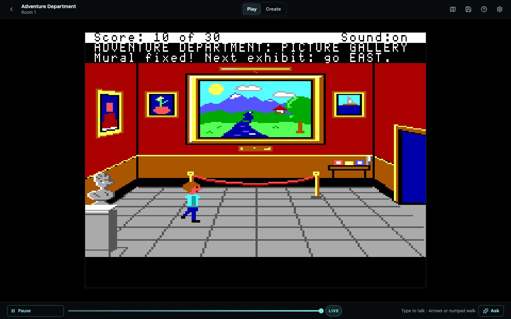
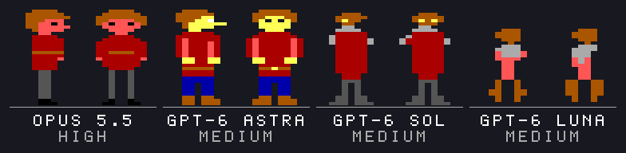
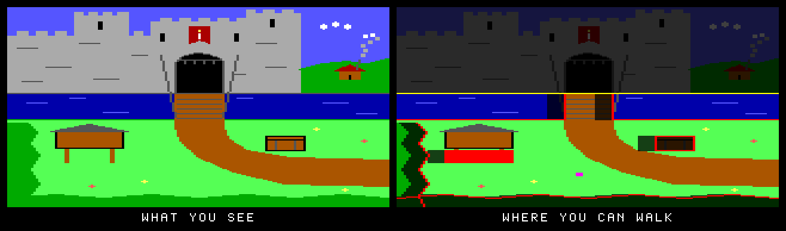
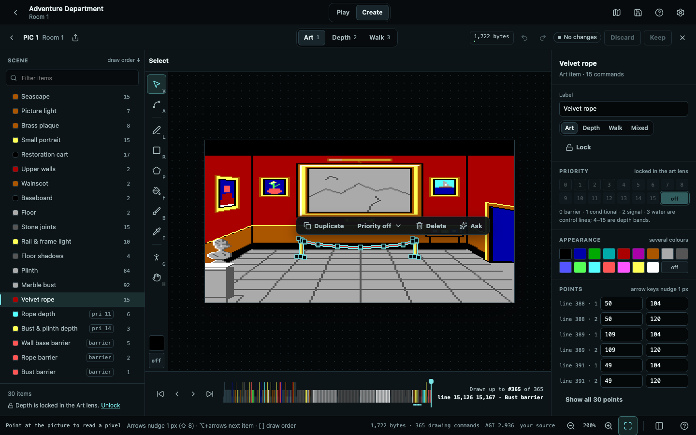
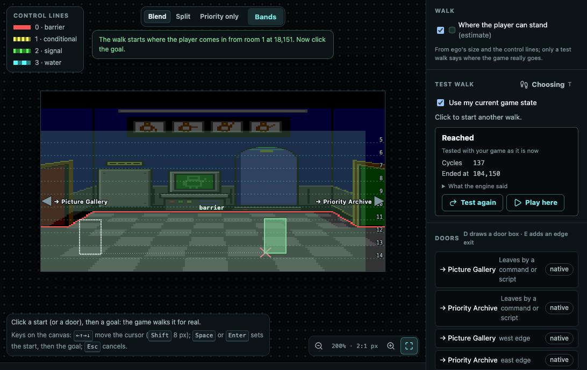
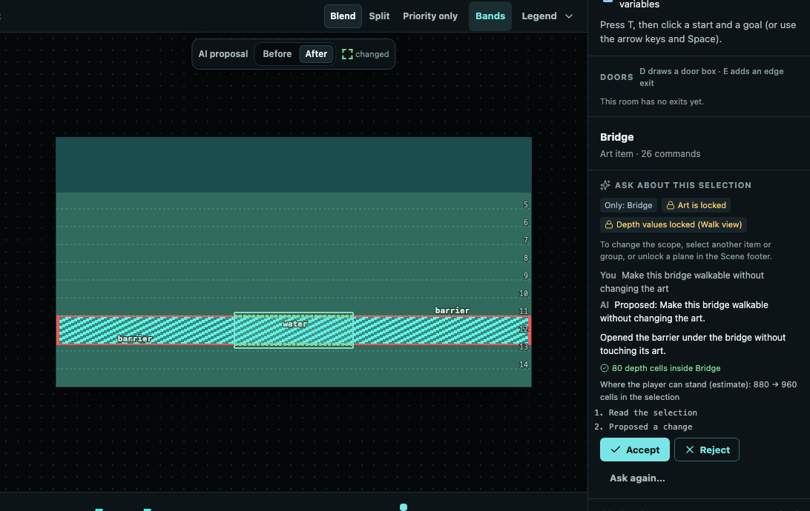
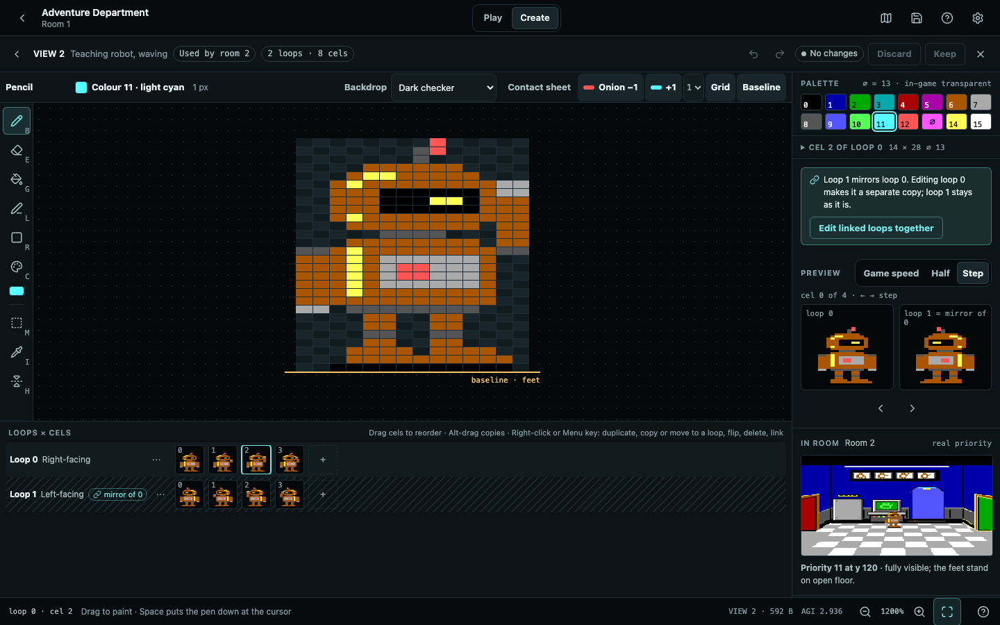

# AGI IS HERE

AGI is here, and it runs in your browser. It understands commands like LOOK AT
CASTLE, it draws in sixteen colours, and if you ask, it will put an alligator
in the moat while you are standing next to it.

This AGI is Sierra's
[Adventure Game Interpreter](https://en.wikipedia.org/wiki/Adventure_Game_Interpreter),
the engine behind King's Quest, Space Quest and Leisure Suit Larry, rebuilt
from scratch, with manual editors and an optional AI co-author. Play the classics
from your own copies, create a game in the Studios, or describe a new
adventure and play it while an agent builds the world around you. With an agent
connected, ask for changes mid-game: give the guard a different personality, add
a puzzle, or turn the courtyard into a swamp. Everything you make is a real AGI
game that you can inspect, download and play again.


_One brief, five models. Each castle is a real AGI picture drawn in vector
commands, with a working moat, a hero and a game behind it, for between three
cents and two dollars. From the [Genesis benchmark](evals/benchmarks/genesis/1.0.0/README.md)._

## Try it

Open [agi.monotio.com](https://agi.monotio.com/) and click **Play now** on
**Adventure Department**, a three-room tutorial about how these games are made:
you repair a picture, wake up an actor and sort out a clerk's Depth. It is
ready to play in your browser.



- **Play your own Sierra games.** **Add game** takes a ZIP or a game folder.
  The files stay in your browser's storage. The app
  recognises the edition, picks the matching interpreter and checks that the
  game opens.
- **Watch a playthrough.** Verified releases come with a recorded completion
  that replays on the real interpreter, keystroke by keystroke, on the game's
  own clock. Pause it, scrub the timeline, or **Take control** whenever you
  like.
- **Rewind.** Every session records itself, so you can go back to any earlier
  moment and carry on from there.
- **Get help.** **Help** is a short guide to playing, creating and managing your
  games, on the home screen and in a running game's Help menu. Each topic can
  open the control it describes.

## The games it plays

These editions are verified in this interpreter. The PC editions are checked
with recorded walkthroughs; the Amiga and Apple IIgs editions boot into their
first room under their own interpreters.

| Game                       | PC (DOS) | Amiga | Apple IIgs | Recorded walkthrough |
| -------------------------- | :------: | :---: | :--------: | -------------------- |
| King's Quest I             |   Yes    |       |            | Full game            |
| King's Quest II            |   Yes    |  Yes  |            | Full game            |
| King's Quest III           |   Yes    |       |            | Full game            |
| King's Quest IV            |   Yes    |       |            | Full game            |
| Space Quest I              |   Yes    |  Yes  |            | Full game            |
| Space Quest II             |   Yes    |  Yes  |    Yes     | Full game            |
| Police Quest I             |   Yes    |  Yes  |            | Full game            |
| Leisure Suit Larry I       |   Yes    |       |            | Full game            |
| The Black Cauldron         |   Yes    |       |            | Full game            |
| Mixed-Up Mother Goose      |   Yes    |       |            | Full game            |
| Donald Duck's Playground   |   Yes    |       |            | One chapter          |
| Gold Rush!                 |   Yes    |  Yes  |            | Full game            |
| Manhunter: New York        |   Yes    |       |            | Full game            |
| Manhunter 2: San Francisco |   Yes    |  Yes  |            | Full game            |
| Sierra AGI demo pack 4     |   Yes    |       |            |                      |

A few things worth knowing:

- **Walkthroughs** are recorded on the PC editions and tied to the exact release
  they were captured on. The
  [KQ1 completion proof](docs/testing.md#kq1-completion-proof) shows how one is
  made and checked.
- **Sound** follows the machine. Amiga editions play through emulated Paula,
  the IIgs edition through its own Ensoniq wavetable instruments read from the
  game's files, and PC editions through the Tandy sound chip or the PC speaker,
  under **Settings → Advanced… → Sound chip**.
- **Mouse** clicks walk the hero on the Amiga and IIgs editions, as they did on
  the originals.
- **The picture** fills a 4:3 frame, the way a monitor of the day stretched the
  320 × 200 screen. **Settings → Original 4:3** turns that off for square
  pixels.
- **Text** uses this project's own 8 × 8 font in the original character grid. It
  covers English text and the box drawing the Sierra games print; other
  characters show blank.
- **Fan-made games** run too. If the app cannot tell which interpreter a game
  needs, it asks. [Testing](docs/testing.md#testing-compatibility) lists the
  exact editions and builds.

Bring your own copies of commercial games; they stay in your browser.
Explore over a hundred free AGI games made by fans since the late nineties, collected
on the
[AGI Wiki's fan release list](https://agiwiki.sierrahelp.com/index.php/Fan_AGI_Release_List)
and in the
[SCI Programming community's game list](https://sciprogramming.com/fangames.php?eng=agi&cat=Complete&sort=downloads).
Fan games span many genres and audiences.

## Make your own adventure

**Create an adventure** on the home screen offers two ways in. **Create
game** builds a playable project in your browser: **Starter**
opens in a sunny clearing you can walk through, with an animated hero and
the shared menu, death and save code, all editable; **Blank** is the
smallest game that still runs, one room showing an empty picture. Both open
in Create as ordinary AGI games you can edit in the Studios, and a
connected provider can pick them up later like any other project.

To edit a saved game's code, open its library card's **Game actions → Edit**.
**Logic Studio** gives you source tabs, code completion, hover help, definition
navigation and a Problems panel. Edit the logic and vocabulary,
choose which changes to build, inspect the diff, then **Save** them in the library.
Unfinished work stays in a separate draft and is offered for recovery when you
reopen. Games from the shared catalog need a personal copy before editing.

**Build with AI** keeps the themed briefs. Pick a template or describe your
own hero, setting and trouble, connect an OpenAI or Anthropic API key, and
click **Create adventure**.

| Template                                                | Your predicament                                                     |
| ------------------------------------------------------- | -------------------------------------------------------------------- |
| [Knight's Trial](games/knights-trial/SKILL.md)          | Find three impossible treasures before the kingdom runs out of time. |
| [Badge of Millhaven](games/badge-of-millhaven/SKILL.md) | A rookie cop discovers that procedure is easier to follow on paper.  |
| [Mop Jockey](games/mop-jockey/SKILL.md)                 | The station needs a hero. It has sent the cleaner.                   |
| [Polyester Nights](games/polyester-nights/SKILL.md)     | A middle-aged lounge lizard tries his luck for one more night.       |

The agent plans the world and builds the opening room: artwork, characters and
game logic. When you walk into a room that is still unbuilt, play pauses
while the agent writes it. Along the way you can:

- plan on the world map in Create's World panel: rename rooms, edit their
  briefs and pin notes the agent reads when it builds that part of the world;
- use **Ask** in Play for hints and questions that leave the game untouched,
  or **Remix** in Create to change it, including any game you imported;
- attach reference images for rooms and actors: the agent gets a
  thumbnail of each and looks closer at the parts it needs;
- preview the game's sounds as WAV clips.

Everything the agent writes is a standard AGI resource: logic, vector pictures,
animated actors, vocabulary, inventory and sound. The heroes above walk because
the agent drew each frame of each direction, then compiled them into the same
kind of view file Sierra's artists made:



An AGI room is also more than its picture. Behind it the game keeps a second,
invisible layer: how far away each part of the scene is, and where the hero may
and may not walk. The agent paints that layer too, so the knight walks around
the notice board and the chest, stops at the water's edge and crosses by the
drawbridge:



The agent checks its own work with rendered previews, compiler messages and
playtests of its own. It can still get art, puzzles or writing wrong, so play
it, and ask for revisions when something is off.

**Your key and provider.** The app talks to your provider directly
from the browser. Your key is saved in browser storage and sent only to the
provider you choose, along with the game content each request needs. Requests
are billed to your account; each task starts with an estimated $5 budget that
you can change. The agent pauses between requests when the remaining allowance
is too small for another productive turn; one response may cross that allowance.
Models with unverified prices ask for an allowance in requests and show spend
as unknown. Long conversations compact their request context while keeping the
full audit transcript. The provider's prompt cache reuses prior context at its
lower cache-read price. What
the agent writes comes from your provider's model. Review the story, puzzles and artwork before
sharing the game, especially with children. [Security](SECURITY.md) covers storage and data flow, and
[adventure briefs](games/README.md) covers writing your own templates.

## Edit every room by hand

A running game has two modes, switched in the top bar. **Play** is the game as
its players see it. **Create** docks the tools around it: the world map and its
rooms on the left, the assistant on the right. From a room in the World panel,
its picture opens in **Room Studio** and its views in **VIEW editor**. Room
Studio, VIEW editor and Logic Studio are designed for a larger screen than a
phone; games play on phones too.

In Create, **⌘P** (Ctrl+P) opens the game’s parts and **⇧⌘P**
(Ctrl+Shift+P) opens the command palette. Type **>** in quick open to find
commands. **⌘B** toggles the parts list, **⌘I** opens the agent, and **⌘Enter**
shows Play full size (use Ctrl in place of ⌘ elsewhere). **F6** and **Shift+F6**
move between visible focus zones; **Ctrl+backtick** focuses the game. The game takes
keys while its zone has focus. **Escape** closes the chooser and returns focus.
**Help → Keyboard shortcuts** lists the registered commands and keys; actions
awaiting an editor or debugger implementation appear as **Unavailable**.

<p align="center">
  <a href="docs/media/room-studio.png"></a>
  <a href="docs/media/room-studio-walk.png"></a>
  <a href="docs/media/studio-ask.png"></a>
  <a href="docs/media/sprite-studio.png"></a>
</p>

_Left to right, top to bottom: Room Studio with the velvet rope selected, a test
walk across the Sprite Lab, an agent change, and the VIEW editor on the
waving robot._

- **Room Studio** shows a room's picture under three lenses: Art for what the
  player sees, Depth for what stands in front, and Walk for the lines that steer
  the hero. A scrubber replays the draw order command by command, the
  scene list names what the picture draws, and clicking a pixel shows the
  command that put it there.
- **Editing** works on items: click one to select it, or drag a box to select
  the items wholly inside it; drag the selection, or its points with the Point
  tool, nudge it with the arrow keys (a move stops at the picture's edge),
  change its colour, Depth or draw order, duplicate or delete it.
  Alt+click, or Alt+Enter from the keyboard, adds a point to a selected line.
  A box, Shift+click, a group row or Shift+Alt+arrows select several
  items, which then move, copy and delete together as one step, so an imported
  bush's outline and fill stay together; Group (⌘G) names neighbours as one
  item without changing a byte, and Ungroup (⇧⌘G) splits it again.
  The tool rail draws lines, rectangles, polygons, fills and brush strokes at
  the slider's point in the draw order, and a stand-in shows whether a
  character would stand in front of the scene or behind it.
- **Save** saves the picture into the game. Each lens locks painting on the
  other planes until you unlock them, while a whole item moves with all its
  planes; every change can be undone, even after saving, and leaving with
  unkept changes asks first.
- **Test walks and doors** live in the Walk lens. A test walk runs the real game
  in a throwaway copy and reports Reached, Blocked at whatever was in the way,
  the room it went to, or the message that stopped it. A goal on a door box or
  an edge walks through it (to the edge, then one step across), and a door a
  walk went through is marked tested. Door boxes and edge exits
  lead to other rooms; a door can follow its doorway art, so moving the art
  moves the door in the same save. Exits written in the room's own logic stay
  read-only. Right-click any spot and **Play here** jumps into the game there.
- **Agent** has your connected AI change only the selected items: "make this
  bridge walkable and preserve the art". Attach reference art (a file, a
  drop or a saved image) and the AI can look at it while it works. Its changes
  show on the canvas, Before or After, with the changed cells outlined. The
  app's own checks hold it to the selection and the lens's locks, and Approve
  makes it one undo step.
- **VIEW editor** edits a view's loops and cels. Open it from a room's views,
  the Resources tab or a staged character sheet, draw with the pixel tools, and
  reorder, duplicate and flip cels on a loops × cels timeline. The previews play
  the loop at the game's speed and stand it in a room at its real depth. Editing
  a loop that mirrors another makes it a separate copy, so fixing one facing
  leaves the other as it is unless you edit both. The agent works here too, on the selected
  cel or its whole loop, with every other loop protected.
- **Explainers** sit beside the Studios' terms: each ⓘ says in one sentence
  what the control does and links to its Help topic. Each Studio shows a
  three-step tour the first time it opens, and **Tour** in its `?` key list
  plays it again.

## Save and share

Games, saves and history live in your browser. The game's own Save and Restore
use the authentic AGI save format, with twelve named slots per game, and the
app saves as you play, so **Resume** picks up where you left off.

| Settings → This game | What you get                                                                                                                                               |
| -------------------- | ---------------------------------------------------------------------------------------------------------------------------------------------------------- |
| **Export game…**     | A ZIP of the playable resources and public metadata: description, author, license and remix provenance.                                                    |
| **Download game…**   | A ZIP of the game plus its authoring conversation, images, source descriptions, world notes, stored tests, map, session history, saved games and autosave. |

Either ZIP opens again with **Add game**, in any browser. A game without a
declared license keeps an unknown license in its exports; the MIT license covers
this repository's own code and assets.

## Thirty years later

Around 1996, **Lance Ewing, Peter Kelly, Martin Tillenius** and I worked on
**MEKA**, an early fan-made AGI interpreter. I was **Joakim Möller** then. We
traded discoveries about how Sierra's adventures worked.

On 3 September 2026, Greg Brockman closed an OpenAI briefing with
[“Welcome to the AGI era.”](https://www.axios.com/2026/09/03/openai-astra-gpt-6-agi-brockman)
I took him at his word. With OpenAI's
[GPT-6 Astra](https://developers.openai.com/api/docs/models/gpt-6-astra) in
Codex, I went back to AGI to rebuild the engine, and to let an agent change the
game while I was playing it. Now I can ask for an alligator in the moat, and the
agent rewrites the game's own bytecode to put it there. Thirty years on, that is
still a very cool thing to be able to do.

**Peter Kelly's [agi-re behavioral specification](https://peterkelly.github.io/agi-re/spec/)
is the foundation of this independent implementation.** It documents the
formats, observable behavior and interpreter versions, and is published under
[CC0](https://github.com/peterkelly/agi-re/blob/main/LICENSE). Thank you, Peter.

## As close to the originals as we could get

Every Sierra AGI game shipped with its own build of the interpreter, and the
builds do not quite agree. On a PC, a wandering guard whose countdown runs out
walks 256 more steps before he turns; on an Amiga he turns every 7 to 51
steps. Details like that decide whether a puzzle is fair, so the engine keeps
them.

It starts from Peter Kelly's CC0
[agi-re specification](https://peterkelly.github.io/agi-re/spec/), a clean-room
description of how AGI behaves. Where a game needs more than the specification
says, or where builds disagree, the original interpreter's machine code was read
and often run in isolation with controlled inputs, on PC builds from 2.089 to
3.002.149 and on the Amiga and Apple IIgs interpreters. The random-number
generator alone was executed from ten original executables for all 65,536 of
its states. Each finding is written down with its evidence and held in place by
a regression test, and full-game walkthroughs of thirteen games replay on the
engine keystroke by keystroke. [Interpreter compatibility](docs/fidelity.md)
tells the whole story, from that random-number generator to the Amiga sound
driver.

Under the hood, the engine is a TypeScript AGI interpreter with no framework
and no runtime dependencies. It reads AGI v2 and v3 game files, including the
Amiga and Apple IIgs layouts, and picks each build's behaviour through
interpreter profiles. Games made in the app are standard AGI 2.936 bytecode
with no custom opcodes. The engine runs in a Web Worker; the Vue shell adds a
GPU-rendered CRT display and an in-game command line, while game text stays on
the original 40 × 25 character screen.

## How it's built

Coding agents build this project, alongside the agent inside it, and the
repository checks the work of both.

- **A written agreement.** [AGENTS.md](AGENTS.md) holds the conventions,
  boundaries and method every contributor follows, person or agent: evals
  before features, and a check nobody has seen fail counts as a comment.
- **Authority in code.** The in-app agent can only call the tools on its
  session's [allowlist](src/agent/tools.ts), and what it writes still has to
  get past the assembler, the resource checks and the Studio's pixel-level
  validators.
- **Mistakes become evals.** A model error that recurs is stored as a bad case,
  [like this one](evals/fixtures/bad-cases/write-picture-source-y168.json),
  and replayed offline on every check.
- **One gate.** `npm run check` runs the typecheckers, ESLint,
  [ast-grep rules](.ast-grep/rules), knip,
  [dependency rules](.dependency-cruiser.mjs), a design-token ratchet, a
  [contrast test](app/test/token-contrast.test.ts), the engine and app tests,
  and the stored evals. [CI](.github/workflows/ci.yml) adds Playwright in
  Chromium and WebKit.
- **Budgets.** The startup path, from Home to a game's first frame, has a
  [bundle budget](scripts/check-bundle-budget.ts) that also keeps Studio and
  the AI stack off it, and [interaction budgets](app/e2e/perf-budgets.spec.ts)
  bound boot long tasks and Studio frame and input times.
- **Tests that are tested.** [Mutation testing](stryker.config.mjs), run on
  demand, checks that the picture and Studio kernels' tests catch deliberate
  bugs.
- **Paid runs by consent.** An eval runner calls a provider only with both
  `--live` and `--budget-usd` on the command line, and `npm run eval:cache`
  checks offline that every request keeps the one before it as its prefix, so
  the prompt cache keeps working.
- **Measured models.** The [Genesis benchmark](evals/benchmarks/genesis/1.0.0/README.md)
  gives five models the same briefs and publishes every run, its cost and the
  game it made.

[How it fits together](CONTRIBUTING.md#how-it-fits-together) maps the code.

## Run it yourself

Install Node.js 22.22 or newer, then:

```bash
npm ci
npm --prefix app ci
npm run dev
```

Open `http://localhost:5199/`. The site needs a connection to load; it is not
an installable offline app yet. Exported games play offline in any compatible
interpreter.

| Document                                                | For                                                             |
| ------------------------------------------------------- | --------------------------------------------------------------- |
| [Interpreter compatibility](docs/fidelity.md)           | How the original interpreters behave and how the engine matches |
| [Contributing](CONTRIBUTING.md)                         | Development setup, architecture, checks and pull requests       |
| [Testing](docs/testing.md)                              | Game fixtures, walkthrough proofs and compatibility checks      |
| [Hosting](docs/hosting.md#including-games-on-your-site) | Running your own copy and adding games to its catalog           |
| [Evals](evals/README.md)                                | Measuring authoring quality                                     |
| [Media gallery](docs/media/README.md)                   | Screenshots of the app, the Studios and the agent's tools       |
| [Security](SECURITY.md)                                 | Keys, storage and data flow                                     |

## License

Created by Joakim Riedel and published by [Monotio](https://monotio.com). The
engine, authoring tools, browser shell and original project assets, including
the Adventure Department tutorial, use the [MIT license](LICENSE).
Dependencies and imported games keep their own licenses; no commercial game
assets are part of this repository. The icons are a hand-picked
[Lucide](https://lucide.dev) set ([app/src/ui/icons.ts](app/src/ui/icons.ts)),
with [ISC and Feather MIT notices](app/public/licenses/lucide.txt) included in
the build.
