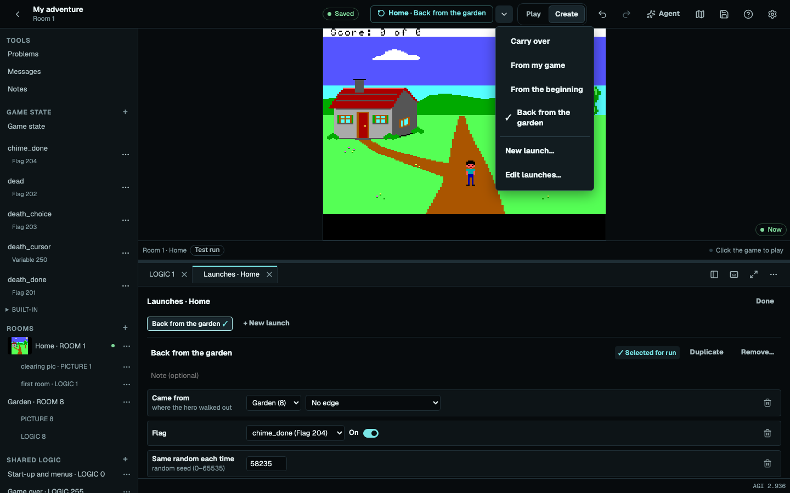
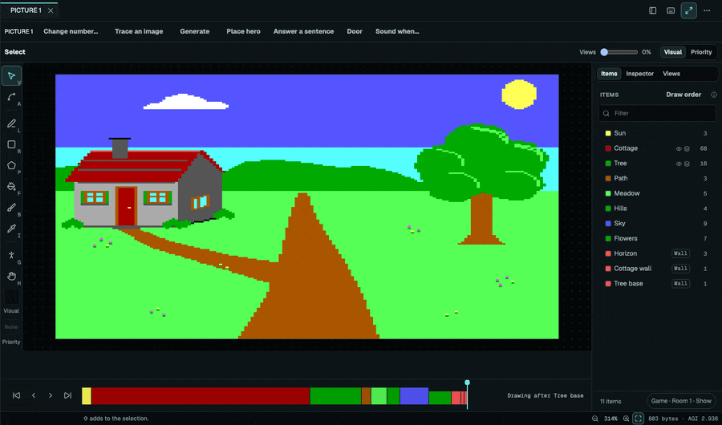

# The Create workspace

Create is where you edit a game while it runs. This guide tours the workspace, its editors and its
keys. For a first walk-through, start with [Build your first game](first-game.md); for the AI
co-author, see [Building with AI](ai.md).

## Starting a game

**Make a new game** on the home screen offers four choices:

- **Starter** opens in a sunny clearing with an animated hero, menus, saving and game-over handling.
- **Boilerplate** supplies the shared boot, menus, saving and game-over code for your own rooms and
  artwork.
- **Blank** opens an empty workspace.
- **Create with AI** builds the opening from Boilerplate with your provider.

Choose **Start building** to open the project in Create. **Add a room** can supply its first room.
Every part of these starting games is editable.

To edit a saved game, open its library card's **Game actions → Create**. Games from the shared
catalog need a personal copy before editing.

## The workspace

A running game has two modes, switched in the top bar. **Play** is the game as its players see it,
with the rewind timeline. **Create** shows the parts list on the left and the same running game on
the stage.

- Open a PICTURE, LOGIC or VIEW to edit it beside the game. Opening another room's part opens its
  editor.
- Editors sit beside the stage, or below it with **Stacked**. Phones switch between **Edit** and
  **Game**.
- **Focus** gives an editor the whole workspace while the game keeps running. Toggle it again, or
  press Escape twice, to return. Focus is remembered for each editor type.
- **Play** enters the room using its selected Launch. Unused art opens with **Make it a room**.
- **Game state** in the parts list names the game's flags and variables, with Rename.
- **Explainers** sit beside resource headings and editor terms. Hover, focus or click a **?** for
  its help line; editor explainers link to their Help topic.

Create works best on a larger screen. Games play on phones too.

## Drafts, updates and History

Edits save automatically as drafts. **Draft saved** confirms that pending edits are stored in this
browser, and dots mark the parts waiting for an update.

**Update and restart** applies all changed parts together as one Undo step and runs the open room's
entry LOGIC. Until then the game keeps running your last update. A source error keeps the game on
its last working build, and **Saved** confirms the updated project.

**Undo** and **Redo** step across edits to every part. **Saved** opens **History**, where you can
name a checkpoint or restore an earlier one. **Discard changes…** returns parts to the last update.

## Launches

The top-bar action shows an icon whose tooltip names **Update and restart**, **Restart** or **Play**
for the selected room. Its menu selects **Carry over**, **From my game**, **From the beginning** or
one of the room's saved Launches. **From my game** restores the moment you left Play, on your
updated files.

A saved Launch starts the room with chosen rows: where the hero came from, flags, variables, item
locations and the same random numbers each time.

**Launch options → New launch…** stores a named Launch for the room. Launch settings save without
applying drafts. Restart runs a Launch again, so a death can be tuned over and over.

**Update and keep playing** preserves the game's moment; a waiting message finishes before its
changed LOGIC runs. Create uses temporary progress and save slots. With two tabs open, the newest
tab plays, and **Take back** returns control to the older tab.

## Editors

### PICTURE

The PICTURE editor shows a room's picture in Sierra's two layers: **Visual** for what the player
sees, and **Priority** for what stands in front, plus the walls, water, triggers and gates that
steer the hero.

- The items list names what the picture draws. "Insert here" on an item draws new shapes before it.
- The tool rail draws lines, rectangles, polygons, fills and brush strokes at the selected point in
  the draw order. A stand-in shows whether a character would stand in front of the scene or behind
  it.
- Click an item to select it, or drag a box to select the items wholly inside it. Drag the
  selection, or its points with the Point tool, and nudge it with the arrow keys. Change its colour,
  depth or draw order, duplicate it or delete it.
- Alt+click, or Alt+Enter, adds a point to a selected line.
- A box, Shift+click, a group row or Shift+Alt+arrows select several items, which then move, copy
  and delete together as one step. **Group** (⌘G) names neighbours as one item without changing a
  byte; **Ungroup** (⇧⌘G) splits it.
- Each lens locks painting on the other planes until you unlock them, while a whole item moves with
  all its planes.
- **Views** blends in the figures the room places, as the game draws them. Drag a figure with a
  plain-number position to draft its LOGIC placement. A computed placement drags as a preview with
  Reset and Copy position, and **Set in** opens the lines that place it.

### Tracing an image

**Trace an image** blends a dropped, pasted or chosen image over a PICTURE at adjustable opacity,
and **Behind art** places it beneath the drawing. Opacity and placement follow Undo and History.

**Generate** uses your OpenAI key to draw from your words in Sierra EGA style. Details holds the
model, quality and size, and the agent's task budget covers these images too. Images autosave with
History and travel in private project downloads; public game exports carry the resulting AGI
resources.

### VIEW

The VIEW editor edits a view's loops and cels beside the running game. Draw with the pixel tools,
and reorder, duplicate and flip cels on the timeline. The previews play each loop. **Edit both**
keeps mirrored loops together; editing one gives it its own cels.

**Make cels from an image** opens a zoomable sheet with boxes around the figures it finds:

1. Adjust the boxes. Found frames are linked, so resizing one edge changes their shared size; click
   the link chip to adjust one frame on its own, or click the selected frame's dimensions to type
   exact numbers.
2. Drag the prepared cel thumbnails into order and choose the destination loop. One **Size** control
   sets the height and keeps the figure's proportions.
3. Try the animation on the running hero, then **Add cels** adds the frames and the image in one
   History step.

**Find frames** again asks before replacing boxes you have edited.

### LOGIC

LOGIC has code completion, hover documentation, definition navigation and a Problems panel. Resource
names open their editors, and flags and variables show where they are set and checked. **+ Add**
guides **Add a room**, **Place hero** (with Start here or a drag), a drawn **Door**, **Answer a
sentence** and **Play a sound when…**.

The [LOGIC language reference](logic-language.md) lists every command. The same code intelligence
runs in other editors through the [LOGIC language server](editor-setup.md).

### SOUND

SOUND opens beside the game.

- Draw the three voices and drums on the **Grid**, or type notes, tick lengths and hex volumes in
  the **Tracker**.
- **Choose preset** previews recipes and adds a new SOUND. Set tempo and snap, and press **Space**
  for a private audition.
- Import MIDI type 0 or 1, or SN76489 VGM 1.50 or 1.51, after reviewing the conversion summary. Drop
  music onto the editor or the game to import it. Exports are type 1 MIDI at the nearest musical
  pitch.
- **Details** exposes native ticks, divisors and attenuation. Musical views keep exact native values
  until you edit them.

Edits save to History and play the next time the game uses the sound.

### WORDS and OBJECTS

WORDS groups words by meaning, tests sentences with the game's parser and keeps a local list of
commands that missed during playtests. OBJECTS has a table editor for the inventory.

## Debugging

The debugger has Variables, Watch, Call stack and Breakpoints panels. The top action runs the
selected room and Launch; **F5** runs the same action, or continues while paused.

- **F9**, or a click in the LOGIC gutter, toggles a breakpoint.
- **F10**, **F11** and **Shift+F11** step over, into and out.
- **Shift+F5** stops debugging and leaves the game running.
- **Disable breakpoints**, in the Breakpoints panel or the Launch menu, lets runs pass them. Both
  settings are saved per project.

Stopped runs show their exact running source. **Update and restart** starts a fresh room entry.

## Keyboard shortcuts

Use Ctrl in place of ⌘ outside macOS. **Help → Keyboard shortcuts** in the app lists every
registered command and key.

| Keys              | Action                                                  |
| ----------------- | ------------------------------------------------------- |
| ⌘P                | Open a part of the game; type **>** to find commands    |
| ⇧⌘P               | Command palette                                         |
| ⌘B                | Show or hide the parts list                             |
| ⌘I                | Open the agent                                          |
| ⌘J                | Show or hide Problems                                   |
| ⌘Enter or ⇧⌘Enter | Update and restart the open room                        |
| ⌘K Z              | Focus; press Escape twice to return                     |
| F6 / Shift+F6     | Move between focus zones; Shift+F6 also leaves the game |
| Ctrl+backtick     | Focus the game                                          |
| Escape            | Close the chooser and return focus                      |

The game takes keys while its zone has focus. With the game focused, **F5** saves and **F6** belongs
to the game.
