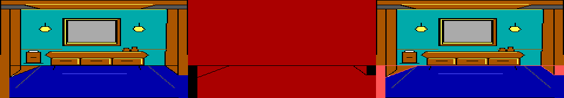
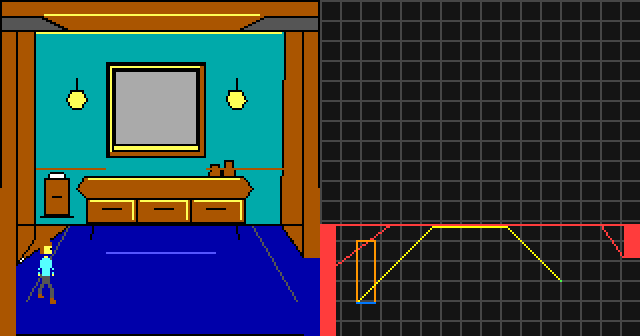
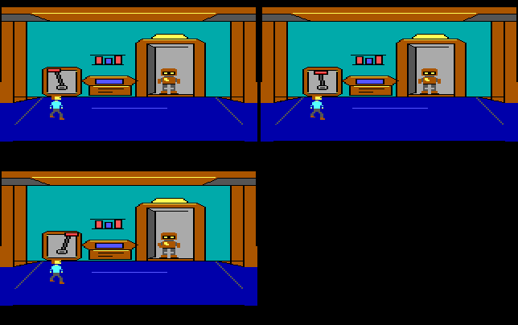
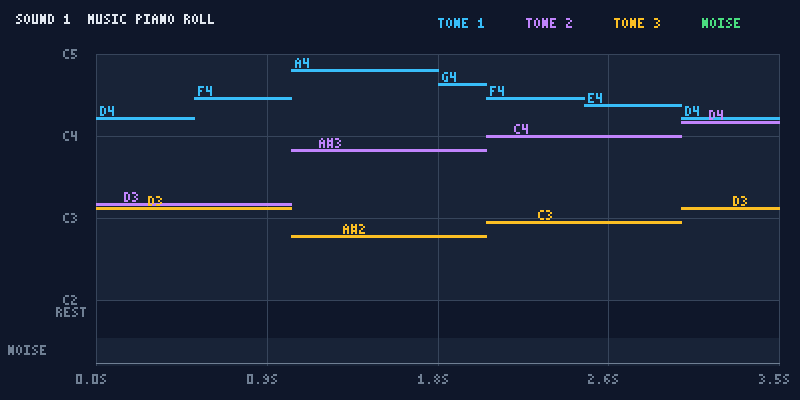
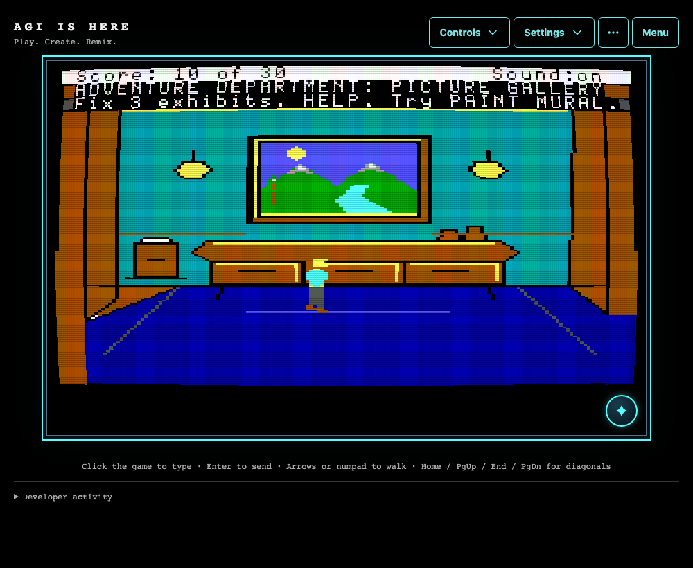
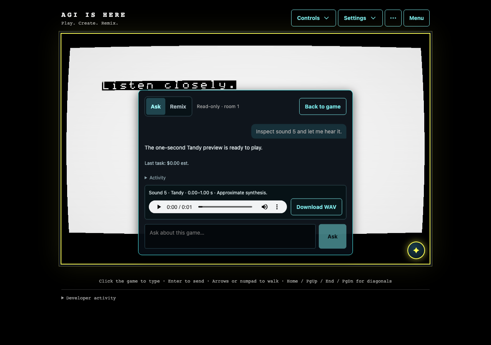

# Media gallery

These captures use Adventure Department and original test resources from this
repository. They are covered by the project's [MIT license](../../LICENSE).

## What the agent sees

The picture tool returns three aligned views: the artwork, its priority/control
plane, and an overlay showing where depth and collision rules affect the scene.



The walkthrough helper can also render a live control map with object footprints
and an advisory path. Yellow shows the candidate path, blue the player's baseline,
and orange the active object bounds. This example plans a walk across the original
tutorial gallery; an executed route must still verify that it reaches the target.



An isolated playtest executes game logic and returns composed frames at requested
checkpoints. These frames show the tutorial's lever moving and the robot waking;
the scenario also asserts the repair flag, score and completion message. Game
text accompanies the tool result separately.



Sound inspection returns note events and a timeline image. The player can hear or
download an approximately synthesized preview; the current provider adapters send
sound data and images to the model, without the WAV audio.



[Listen to the tutorial sound preview](sound-preview-1.wav).

## In the browser

The tutorial gallery after the player paints the mural:



The remix scenario changes the room title from PICTURE GALLERY to REMIX GALLERY
and verifies that the original tutorial remains available unchanged:
[before](remix-before.png) and [after](remix-after.png).
Source: [catalog remix test](../../app/e2e/catalog-remix-resume.spec.ts).
Provider replies are mocked; the resource edits and resumed game are real.

The sound-preview UI exposes playback and a WAV download:



Source: [sound feedback test](../../app/e2e/sound-feedback.spec.ts), using an
original two-tone test resource and mocked provider replies. The timeline and
WAV above use the tutorial's separate opening melody.

## Reproduce the tool captures

From the repository root:

```bash
node --experimental-strip-types scripts/capture-feedback.ts
```

This calls the actual picture, sound and playtest tools against the bundled
tutorial. It writes PNGs, a WAV and captions to `.captures/feedback/` and makes no
provider calls. An optional first argument selects a different output directory.
The playtest must pass its outcome assertions before its images are saved.

## Browser captures

```bash
npm --prefix app exec -- playwright install chromium
AGI_E2E_PORT=5299 npm --prefix app run e2e -- --config playwright.capture.config.ts
```

The capture config runs the tutorial, remix and sound-preview scenarios with one
Chromium worker. It records 1280×900 WebM videos and test screenshots under
`.captures/browser/`; the sound-preview test also writes desktop and phone images
to `app/test-results/`. The selected scenarios use original resources and mocked
provider replies. These recordings demonstrate real UI and tool execution, but
not live model generation or response times. Playwright recordings contain video
only; capture audible playback separately when producing a narrated demo.

Review captures before selecting files for this gallery. Keep descriptive filenames
and captions identifying the feature, source scenario and whether provider replies
were mocked. Commit a small selection of images and short audio examples; keep raw
recordings in the ignored capture directory and host edited launch videos outside
the Git history.
