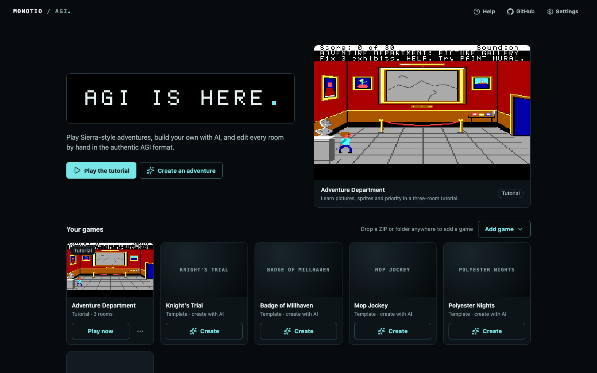
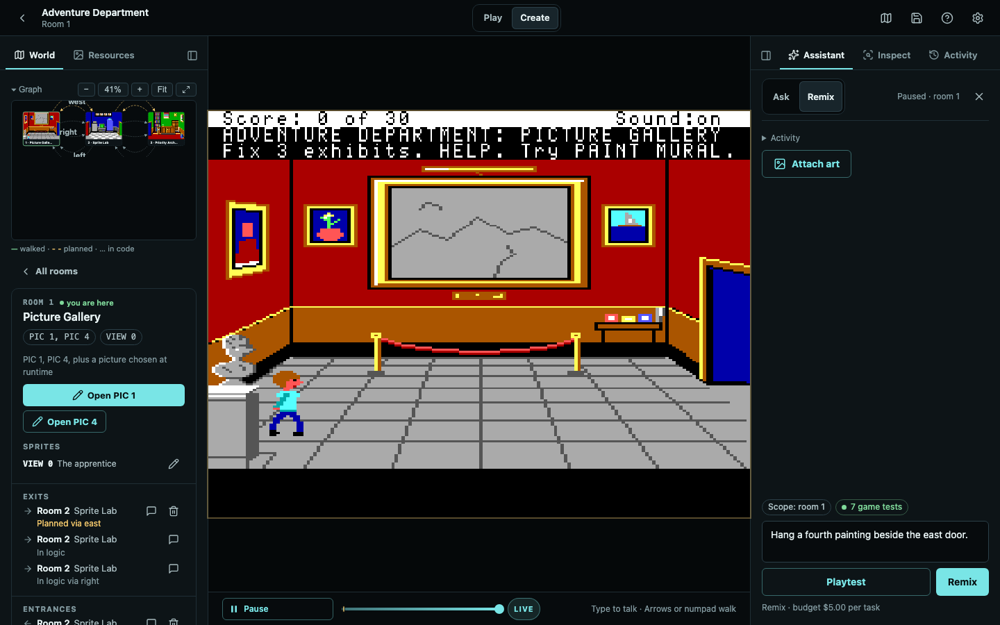
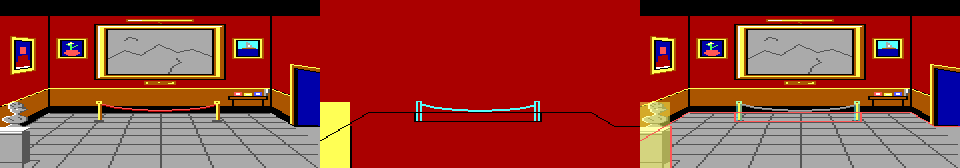
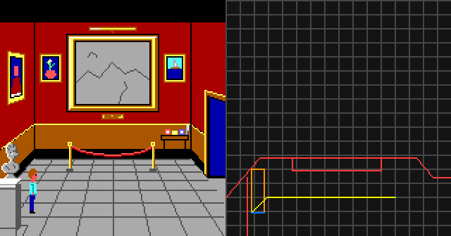
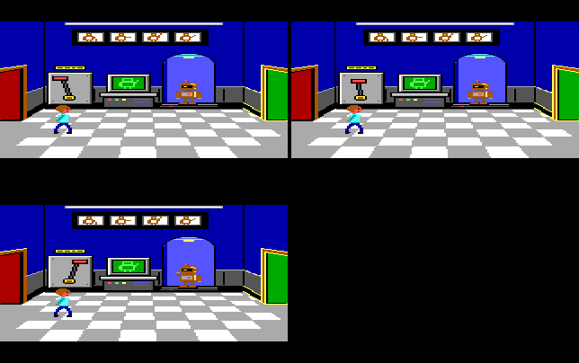
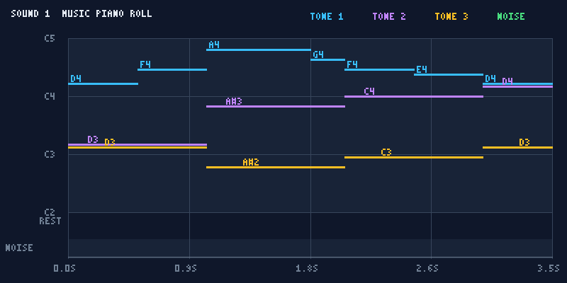

# Media gallery

These captures use Adventure Department and original test resources from this
repository. They are covered by the project's [MIT license](../../LICENSE).

## In the browser

Adventure Department in Play, just after the apprentice paints the gallery's
mural. The picture fills a 4:3 frame, the default display.


Home: the tutorial, the adventure templates and **Add game**.



Create docks the World panel on the left, with the room graph over the room list
or the selected room's pictures and views, and the assistant on the right.



Room Studio in the Art lens, with the gallery's velvet rope selected: the scene
list, the rope's points on the canvas, its inspector and the draw-order
scrubber.


The Walk lens in the Sprite Lab: the walkable estimate as a tint, the room's
doors labelled with where they lead, and a test walk from the west door that
the game ran to its goal.


Ask on the river-crossing fixture from the Studio assist tests: the proposal
with its changed cells outlined, Before and After, and the summary above Accept
and Reject. The stub provider scripts the model's side;
the app's checks and the candidate are real.


Sprite Studio on the tutorial's waving robot, whose loop 1 mirrors loop 0: the
cel canvas, the loops × cels timeline, the loop previews and the robot standing
in its room.


## What the agent sees

The picture tool returns three aligned views: the artwork, its priority/control
plane, and an overlay showing where depth and collision rules affect the scene.



The walkthrough helper can also render a live control map with object footprints
and an advisory path. Yellow shows the candidate path, blue the player's baseline,
and orange the active object bounds. This example plans a walk across the original
tutorial gallery; an executed route must still verify that it reaches the target.



An isolated playtest executes game logic and returns composed frames at requested
checkpoints. These frames show the tutorial's lever moving in the Sprite Lab; the
scenario also asserts the repair flag, score and completion message. Game text
accompanies the tool result separately.



Sound inspection returns note events and a timeline image. The player can hear or
download an approximately synthesized preview; the current provider adapters send
sound data and images to the model, without the WAV audio.



[Listen to the tutorial sound preview](sound-preview-1.wav).

## From the Genesis benchmark

The README's larger pictures come from the committed
[1.0.0 Genesis benchmark](../../evals/benchmarks/genesis/1.0.0/README.md): five
models building the same Knight's Trial opening. Labels use the engine's own
8×8 font.


Four of those heroes walking right and towards the viewer, an animated PNG of
each view's own cels (Opus appears once, at high effort):


One room as the player sees it, beside its walkable ground, barriers and horizon:


Regenerate them from the snapshot with:

```bash
node --experimental-strip-types scripts/benchmark-media.ts
```

## Reproduce the captures

From the repository root, with Chromium installed for Playwright
(`npm --prefix app exec -- playwright install chromium`):

```bash
npm run media:capture
```

This rewrites every file in the first two sections. The browser shots come from
[a capture scenario](../../app/e2e/media/docs.media.ts) that drives the real app
in test mode on its own server, at 1440×900 and device scale 2, with the
deterministic stub provider and no local games. The tool files come from
`scripts/capture-feedback.ts`, which calls the actual picture, sound, playtest
and navigation tools on the bundled tutorial without a provider call; its
playtest must pass its outcome assertions first. PNGs are re-encoded losslessly
where that saves bytes and must stay under 350 KB. The command reports each file
as new, changed or unchanged, so a rerun without UI changes changes nothing. Raw
output stays in the ignored `.captures/media/` directory.

## Browser recordings

```bash
AGI_E2E_PORT=5299 npm --prefix app run e2e -- --config playwright.capture.config.ts
```

The recording config runs the tutorial, remix and sound-preview scenarios with
one Chromium worker. It records 1280×900 WebM videos and test screenshots under
`.captures/browser/`; the sound-preview test also writes desktop and phone
images to `app/test-results/`. The selected scenarios use original resources
and mocked provider replies. These recordings demonstrate real UI and tool
execution, but not live model generation or response times. Playwright
recordings contain video only; capture audible playback separately when
producing a narrated demo.

Keep raw recordings in the ignored capture directory and host edited launch
videos outside the Git history. Commit a small selection of images and short
audio examples, with descriptive filenames and captions that name the feature,
the source scenario and whether provider replies were mocked.
