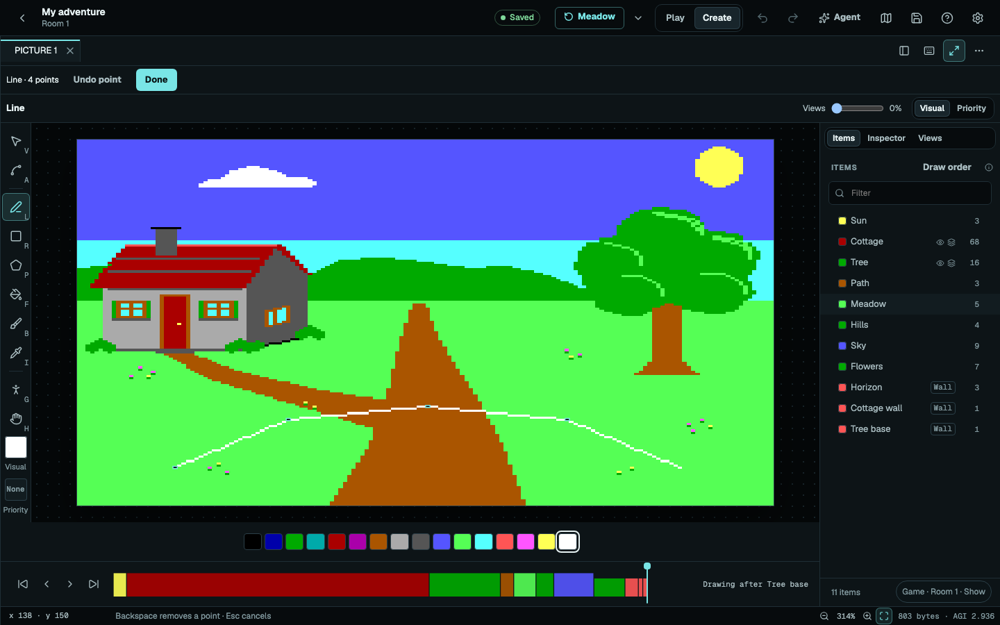
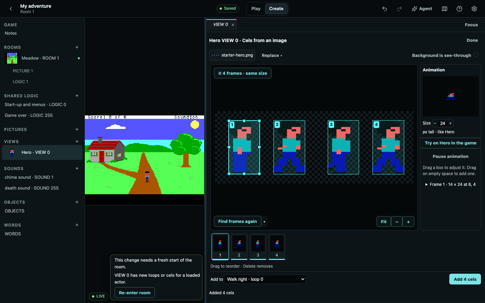
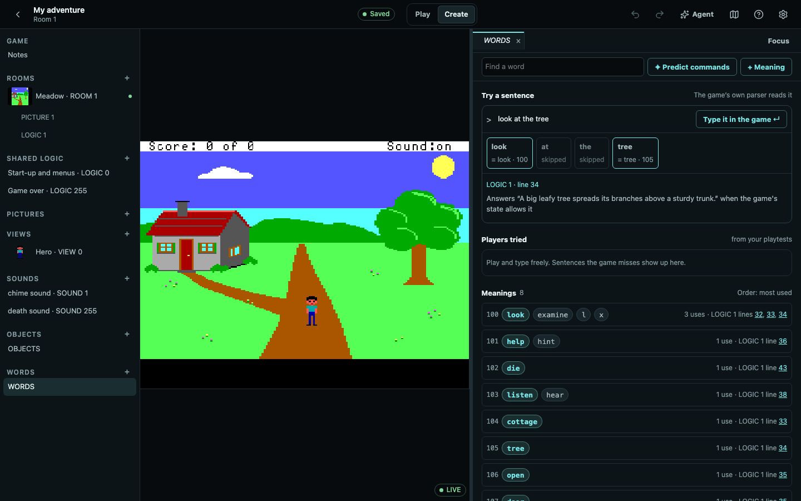
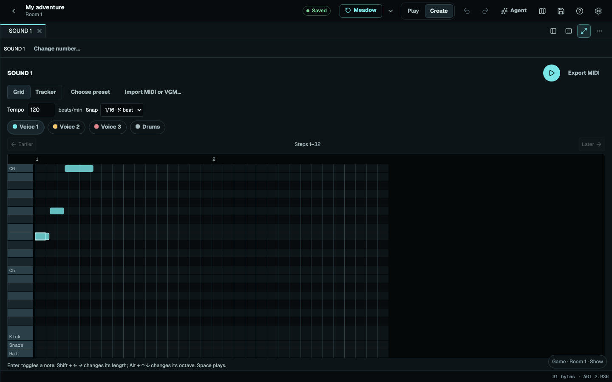
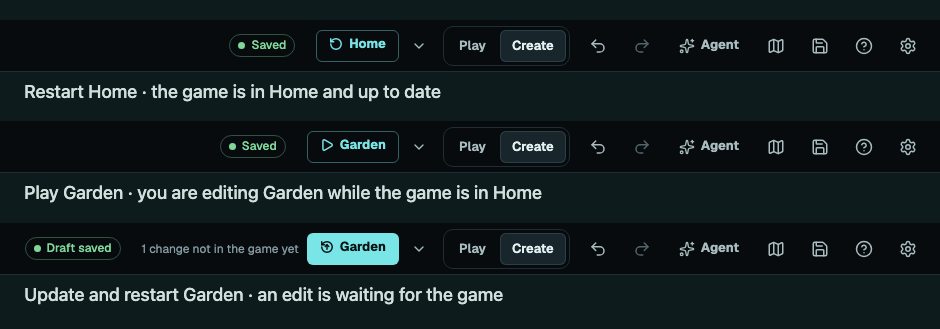
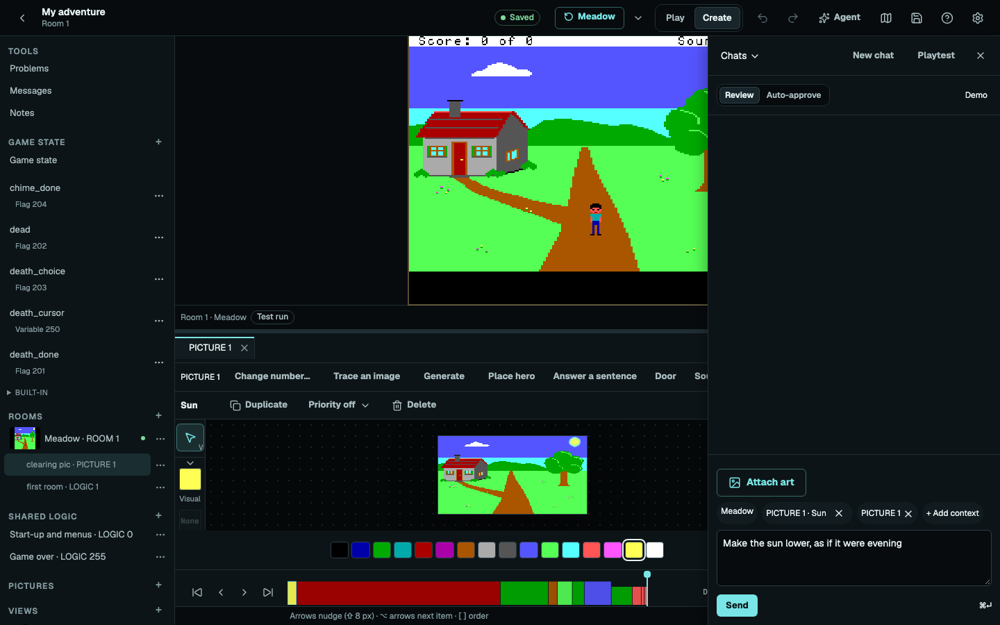
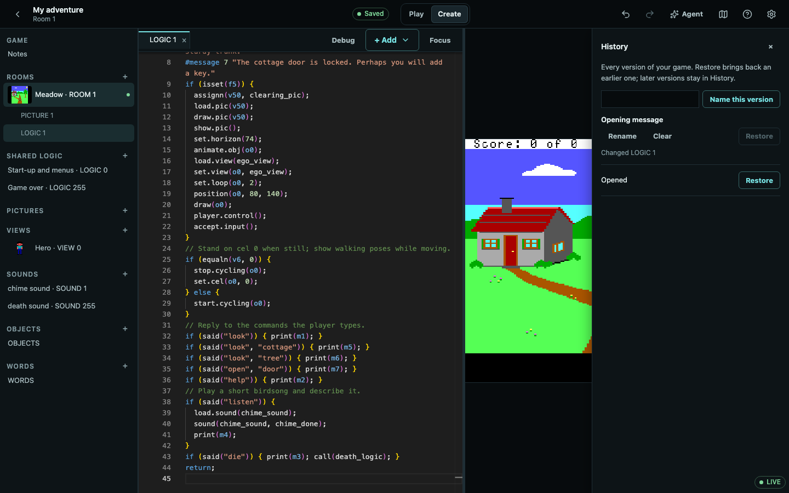
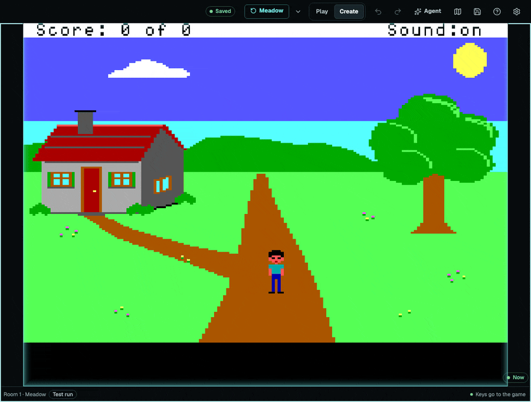
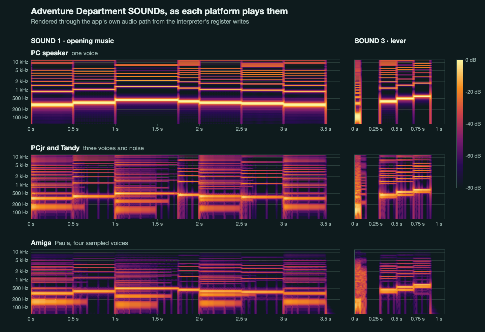

# Media gallery

These captures use Adventure Department and original test resources from this
repository. They are covered by the project's [MIT license](../../LICENSE).

## In the browser

These 1.2 captures use the bundled Adventure Department tutorial and Starter.
AI states use the deterministic stub provider; the room-building capture
replays a recorded provider reply that writes the tutorial's own Sprite Lab
picture. Validation, compiling and resource previews run through the real app.

| Capture                                        | What it shows                                               |
| ---------------------------------------------- | ----------------------------------------------------------- |
| [Home](home-1.2.png)                           | Original tutorial and the game library                      |
| [Make a new game](new-game-1.2.png)            | Starter, Boilerplate, Blank and Create with AI              |
| [Blank start](blank-start-1.2.png)             | A Blank game's first steps inside the game screen           |
| [Play with CRT](play-crt-1.2.png)              | Adventure Department on the CRT display                     |
| [PICTURE workspace](workspace-picture-1.2.png) | Parts list, live Starter game and PICTURE tools             |
| [Drawing a line](picture-line-1.2.png)         | A line in progress, finished from the context row           |
| [LOGIC and Problems](logic-problems-1.2.png)   | Source diagnostics beside the last working game             |
| [VIEW editor](view-editor-1.2.png)             | Loops and cels with the imported walking frames             |
| [Cels from an image](cels-from-image-1.2.png)  | Frame preparation from Starter's original hero              |
| [WORDS](words-1.2.png)                         | Word meanings and sentence testing                          |
| [SOUND grid](sound-grid-1.2.png)               | Musical step grid in Focus                                  |
| [Launches](launch-menu-1.2.png)                | The action menu's Launches and a room's Launch editor       |
| [Action button](action-states-1.2.png)         | Restart, Play and Update and restart, named by their room   |
| [Test run](test-run-1.2.png)                   | Create's game bar marks progress made there as a test       |
| [Agent drawer](agent-drawer-1.2.png)           | The agent beside the editors, with the selection as context |
| [Agent review](agent-review-1.2.png)           | Code differences, art previews, Approve and Reject          |
| [AI rooms](room-setting-1.2.png)               | The game setting that lets the agent build new rooms        |
| [A room being built](room-generation-1.2.png)  | Play waits while the agent writes the next room             |
| [History](history-1.2.png)                     | Saved edits and checkpoint naming                           |



















## Clips

Short GIF loops of the same app and resources, at 15 frames per second and up
to 900 pixels wide.

| Clip                                                | What it shows                                                    |
| --------------------------------------------------- | ---------------------------------------------------------------- |
| [A room built on arrival](clip-room-generation.gif) | Typing EAST walks into a room the agent writes, then enters it   |
| [Drawing a line](clip-picture-line.gif)             | Line tool, a white fence across the meadow, Done                 |
| [Create and back](clip-create-play.gif)             | Play, a look at the PICTURE in Create, and Play resumes the walk |
| [Restart a room](clip-launch-restart.gif)           | A death replayed twice with the action button                    |
| [CRT walk](clip-crt-walk.gif)                       | The hero walking the tutorial gallery on the CRT display         |




## SOUND on each platform

Each original interpreter played SOUND through its own machine's hardware. The
interpreter turns a SOUND into that machine's register writes, one set per
60 Hz tick, and the app's audio graph renders them. These spectrograms render
two of the tutorial's own SOUNDs that way:



The PC speaker plays only the first voice: a square wave with strong odd
harmonics. PCjr and Tandy play all three tone voices and the noise channel
that clicks at the start of the lever sound. The Amiga plays the same notes
from short sampled waves through its output filter, so the upper harmonics are
softer. The Apple IIgs interpreter reads its own SOUND format and Sierra's
instrument bank, which this repository leaves out, so it has no panel here.
The frequency axis is logarithmic; colour shows level below the loudest moment
of the figure.

## What the agent sees

The picture tool returns three aligned views: the artwork, its priority/control
plane, and an overlay showing where depth and collision rules affect the scene.


The walkthrough helper can also render a live control map with object footprints
and an advisory path. Yellow shows the candidate path, blue the player's baseline,
and orange the active object bounds. This example plans a walk across the original
tutorial gallery; an executed route must still verify that it reaches the target.


An isolated playtest executes game logic and returns composed frames at requested
checkpoints. These frames show the tutorial's lever moving in the Sprite Lab; the
scenario also asserts the repair flag, score and completion message. Game text
accompanies the tool result separately.


Sound inspection returns note events and a timeline image. The player can hear or
download an approximately synthesized preview; the current provider adapters send
sound data and images to the model, without the WAV audio.


[Listen to the tutorial sound preview](sound-preview-1.wav).

## From the Genesis benchmark

The README's larger pictures come from the committed
[1.0.0 Genesis benchmark](../../evals/benchmarks/genesis/1.0.0/README.md): five
models building the same Knight's Trial opening. Labels use the engine's own
8×8 font.


Four of those heroes walking right and towards the viewer, an animated PNG of
each view's own cels (Opus appears once, at high effort):


One room as the player sees it, beside its walkable ground, barriers and horizon:


Regenerate them from the snapshot with:

```bash
node --experimental-strip-types scripts/benchmark-media.ts
```

## Reproduce the captures

From the repository root, with Chromium installed for Playwright
(`npm --prefix app exec -- playwright install chromium`):

```bash
npm run media:capture
```

This refreshes the browser captures, clips and spectrograms and the five tool files listed above. The browser shots come from
[a capture scenario](../../app/e2e/media/docs.media.ts) that drives the real app
in test mode on its own server, at 1440×900 and device scale 2, with the
deterministic stub provider and no local games. Name captures to refresh only
those, for example `npm run media:capture -- launch-menu-1.2 clip-picture-line`. Set `AGI_MEDIA_PORT` to choose
a server port (default 5871). The tool files come from
`scripts/capture-feedback.ts`, which calls the actual picture, sound, playtest
and navigation tools on the bundled tutorial without a provider call; its
playtest must pass its outcome assertions first. PNGs are re-encoded losslessly
where that saves bytes and must stay under 350 KB. The CRT capture has an
850 KB limit to preserve its beams and phosphors.

[The clips](../../app/e2e/media/clips.media.ts) record the browser's own
screencast frames with their real timing. Encoding them needs two local tools,
[ffmpeg](https://ffmpeg.org/) to crop and resample the frames and
[gifski](https://gif.ski/) to build the GIF palette; without them the command
skips the clips and refreshes everything else. Each GIF must stay under 2 MB.
The fixed-rate PNG frames stay in `.captures/media/clips/` for other cuts.

[The spectrograms](../../app/e2e/media/sound.media.ts) take the tutorial's
SOUND resources through the interpreter's `SoundPlayback` for the PC 2.936
profile (PC speaker and PCjr/Tandy) and the Amiga 2.310 profile, render the
register writes with the app's `AgiAudio` in an `OfflineAudioContext` at
48 kHz, and draw 2048-sample Hann-window spectra. The noise generator's random
source is seeded, so a rerun gives the same image. The command reports each file
as new, changed or unchanged, so you can review the regenerated files. Live game clocks and CRT effects can
change pixels between captures. Specs write screenshots to their own Playwright output paths. The capture script
copies successful results into `docs/media`; raw output stays in the ignored
`.captures/media/` directory.

## Browser recordings

```bash
AGI_E2E_PORT=5299 npm --prefix app run e2e -- --config playwright.capture.config.ts
```

The recording config runs the tutorial, remix and sound-preview scenarios with
one Chromium worker. It records 1280×900 WebM videos and test screenshots under
`.captures/browser/`; the sound-preview test also writes desktop and phone
images to `app/test-results/`. The selected scenarios use original resources
and mocked provider replies. These recordings demonstrate real UI and tool
execution, but not live model generation or response times. Playwright
recordings contain video only; capture audible playback separately when
producing a narrated demo.

Keep raw recordings in the ignored capture directory and host edited launch
videos outside the Git history. Commit a small selection of images and short
audio examples, with descriptive filenames and captions that name the feature,
the source scenario and whether provider replies were mocked.
