# Genesis quality/cost matrix

Source: `evals/benchmarks/genesis/1.0.0/runs`. One row per completed run (report.json + resources). Regenerate with `npm run eval:matrix -- <results-dir> <out-dir>`.
Measured columns come from report.json, events.json, transcript.json and the AGI files (parsed with the repo's own container/logic/picture/view/sound code). The brief checklist is a keyword heuristic. Judgment lives only in the optional hand-written `reading-<case>.md`.

Definitions: *room code B* = bytecode bytes of room logics (excludes logic 0 and called logics like 255). *said (distinct / groups)* = said() calls in room logics (distinct word-id patterns / distinct word groups). *cmds used* = distinct AGI actions + tests in room logics. *depth-drawn %* = picture cells whose priority is 5..15 (4 is the unpainted default). *ctlN %* = share of the 160x168 plane holding control value N (0 barrier, 1 conditional barrier, 2 trigger, 3 water). *reachable %* = flood fill from the ego start over footprints (ego cel width) that avoid control 0/1, rows at or below the horizon. *authored res.* = resources not byte-identical to the base template.

## badge-of-millhaven (5 runs)

### Cost and efficiency (measured, from report.json and events.json)

| lane | cost $ | wall s | turns | tool calls | repair turns | failures (by kind) | input tok (cached %) | output tok | authored res. | $/res. | playtest |
| --- | --- | --- | --- | --- | --- | --- | --- | --- | --- | --- | --- |
| claude-opus-5-5 high | 3.244 | 845 | 46 | 51 | 9 | 9 (invalid-args 1, assembler 2, other 2, stale-revision 1, playtest-input 1, future-room-exit 2) | 3.95M (96.5%) | 89.4k | 7 | 0.463 | passed |
| claude-opus-5-5 medium | 1.926 | 526 | 38 | 43 | 11 | 11 (invalid-args 1, dictionary 1, assembler 2, stale-revision 2, playtest-walk 2, playtest-input 1, other 1, future-room-exit 1) | 2.68M (97.2%) | 51.3k | 6 | 0.321 | passed |
| gpt-6-astra medium | 2.184 | 452 | 19 | 37 | 5 | 5 (stale-revision 1, assembler 2, future-room-exit 2) | 0.6M (92.2%) | 20.8k | 6 | 0.364 | passed |
| gpt-6-luna medium | 0.042 | 383 | 35 | 58 | 12 | 15 (view 2, picture/scene 1, assembler 1, playtest-expect 2, other 2, playtest-walk 5, future-room-exit 2) | 1.66M (95.4%) | 32k | 4 | 0.01 | passed |
| gpt-6-sol medium | 0.297 | 185 | 18 | 30 | 5 | 8 (view 2, playtest-walk 4, future-room-exit 2) | 0.47M (91.9%) | 11.4k | 4 | 0.074 | passed |

### Content richness (measured from the generated resources)

| lane | room code B | room msgs (chars) | said (distinct / groups) | vocab words/groups | cmds used (room) | room flags/vars | OBJECT items | exits from start | score awards (max) | death calls | anim. objs | views (loops x cels) | ego 4-dir walk | sounds (notes, s) | tests |
| --- | --- | --- | --- | --- | --- | --- | --- | --- | --- | --- | --- | --- | --- | --- | --- |
| claude-opus-5-5 high | 2458 | 65 (5707) | 190 (68 / 43) | 177/64 | 35 | 13/10 | 7 | 2,3 | 50+10 (215) | 0 | 4 | v1:2/2/4/4 v2:2 v3:4 v4:1 | yes (7x28) | template only | 3 |
| claude-opus-5-5 medium | 1211 | 37 (3884) | 100 (96 / 40) | 100/60 | 29 | 6/9 | 7 | 2,3 | 10 (215) | 0 | 3 | v0:2/2/2/2 v1:1/1/1/1 v2:4 | yes (7x28) | template only | 2 |
| gpt-6-astra medium | 745 | 28 (3036) | 48 (48 / 28) | 55/39 | 32 | 9/9 | 2 | 2,3 | 10+50 (215) | 0 | 3 | v1:3/3/3/3 v2:1/1/1/1 v3:4/4/4/4 | yes (10x30) | template only | 5 |
| gpt-6-luna medium | 384 | 10 (1256) | 20 (18 / 16) | 52/37 | 30 | 3/10 | 2 | 2,3 | 10 (-) | 0 | 2 | v1:1/1/1/1 v2:1/1/1/1 | no (8x30) | template only | 1 |
| gpt-6-sol medium | 541 | 21 (2647) | 36 (31 / 22) | 69/44 | 22 | 9/6 | 2 | 2,3 | 10+50 (215) | 0 | 2 | v1:2/2/2/2 v2:1/1/1/1 | yes (13x28) | template only | 2 |

### Picture fidelity: priority and control (measured from the rendered start-room picture)

| lane | pic bytes (cmds) | colours | visual fill % | bands used | depth-drawn % (pri 5-15) | ctl0 % | ctl1 % | ctl2 % | ctl3 % | horizon | ego start (pri) | reachable % below horizon | reaches edges | ctl3 reachable | stands on (top colours % of reachable) |
| --- | --- | --- | --- | --- | --- | --- | --- | --- | --- | --- | --- | --- | --- | --- | --- |
| claude-opus-5-5 high | 3992 (905) | 12 | 96.6 | 4,12 | 2.7 | 14.9 | 0 | 0 | 0 | 64 | 66,132 (4) | 74.1 | left,right,bottom,horizon | no | lgray 85.5, dgray 8.3, brown 3.8 |
| claude-opus-5-5 medium | 665 (121) | 10 | 97.9 | 4 | 0 | 1 | 0 | 0 | 0 | 72 | 110,132 (4) | 83.4 | left,right,bottom,horizon | no | lgray 92.2, dgray 3.6, red 3.2 |
| gpt-6-astra medium | 5032 (1078) | 11 | 97.4 | 4,10 | 7.2 | 0.6 | 0 | 0 | 0 | 85 | 77,143 (4) | 91.8 | left,right,bottom,horizon | no | lgray 64.6, dgray 20.3, brown 5.4, black 3.9 |
| gpt-6-luna medium | 3161 (673) | 10 | 95.3 | 4 | 0 | 2.4 | 0 | 0 | 0 | 0 | 75,145 (4) | 94 | right,horizon | no | lgray 40, brown 34.4, dgray 8.4, white 5, red 4.8, yellow 3.2 |
| gpt-6-sol medium | 2738 (597) | 8 | 98.6 | 4 | 0 | 0.3 | 0 | 0 | 0 | 108 | 76,150 (4) | 99.1 | left,right,bottom,horizon | no | lgray 66.3, black 13.6, brown 10.6, dgray 6.1 |

### Template and authoring behaviour (measured)

| lane | logic 0 | logic 255 | picture writes (using pri) | control cmds written | visible prose chars | top tools |
| --- | --- | --- | --- | --- | --- | --- |
| claude-opus-5-5 high | modified: msgs 17,18; +1 insns (assignn(7,215)) | identical | 2 (1) | 1 | 0 | read_logic 6, playtest_room 6, read_diagnostic 4, read_words 4 |
| claude-opus-5-5 medium | modified: msgs 17,18; +1 insns (assignn(7,215)) | identical | 2 (1) | 1 | 43 | edit_resource_source 8, playtest_room 5, read_logic 4, write_words 4 |
| gpt-6-astra medium | modified: msgs 18; +1 insns (assignn(7,215)) | identical | 1 (1) | 1 | 549 | playtest_room 5, read_authoring_guide 4, read_logic 3, write_view 3 |
| gpt-6-luna medium | identical | identical | 5 (1) | 1 | 0 | playtest_room 17, read_logic 4, write_view 4, inspect_world_bible 3 |
| gpt-6-sol medium | identical | identical | 2 (2) | 2 | 0 | playtest_room 10, read_logic 3, read_authoring_guide 2, write_view 2 |

### Brief checklist (HEURISTIC keyword/structure checks against the brief's starting room; not a quality judgment)

| check | claude-opus-5-5 high | claude-opus-5-5 medium | gpt-6-astra medium | gpt-6-luna medium | gpt-6-sol medium |
| --- | --- | --- | --- | --- | --- |
| precinct / front desk (message) | Y | Y | Y | Y | Y |
| Sergeant Prakash named | Y | Y | Y | Y | Y |
| talk to Prakash (said talk) | Y | Y | Y | Y | Y |
| badge (OBJECT) | Y | Y | Y | Y | Y |
| radio (OBJECT) | Y | Y | Y | Y | Y |
| board readable (said board) | Y | Y | Y | Y | Y |
| lead: driver/pharmacy mentioned | Y | Y | Y | Y | Y |
| receive assignment +10 | Y | Y | Y | Y | Y |
| >=1 exit | Y | Y | Y | Y | Y |
| Dana/Reyes named | Y | Y | Y | Y | Y |
| ego navy/blue uniform | Y | Y | Y | Y | Y |
| palette: red brick + blue + green | Y | - | Y | Y | - |
| lexicon verbs in said() | 7/8 | 8/8 | 8/8 | 6/8 | 7/8 |
| lexicon nouns in said() | 4/8 | 6/8 | 8/8 | 4/8 | 5/8 |
| score | 12/12 | 11/12 | 12/12 | 12/12 | 11/12 |

### Representative tool failures (verbatim, truncated)

- claude-opus-5-5 high `write_logic_source` [assembler]: Assembler error in logic 1: AssemblerError: 208:26: byte value out of range 0..255. Use read_command_reference for the active profile's exact signatures and semantics. Candidates b
- claude-opus-5-5 high `update_world` [invalid-args]: Invalid arguments for update_world; nothing was changed. rooms[2].name is not a known field.
- claude-opus-5-5 medium `write_logic_source` [assembler]: Assembler error in logic 1: AssemblerError: 193:24: byte value out of range 0..255. Use read_command_reference for the active profile's exact signatures and semantics. Candidates b
- claude-opus-5-5 medium `write_words` [dictionary]: Dictionary compilation error: Error: Synonym group 'tray/trays' combines existing word IDs.
- gpt-6-astra medium `write_logic_source` [assembler]: Assembler error in logic 1: AssemblerError: 121:18: byte value out of range 0..255. Use read_command_reference for the active profile's exact signatures and semantics. Candidates b
- gpt-6-astra medium `edit_resource_source` [stale-revision]: Error: Source revision changed. Read the current source before editing; its text, dictionary, profile, or named bindings may have drifted.
- gpt-6-luna medium `write_logic_source` [assembler]: Assembler error in logic 1: AssemblerError: 50:5: word 'dispatch' is not in the dictionary. Use read_words to inspect existing word groups, then write_words to register the missing
- gpt-6-luna medium `write_view` [view]: Invalid facings spec: Error: right must contain 1..15 cels.
- gpt-6-sol medium `playtest_room` [view]: Room initialization did not draw an ego with a valid cel.
- gpt-6-sol medium `playtest_room` [playtest-walk]: steps[0]: walkTo did not reach its goal: needs_input (A modal or suspended interaction needs explicit host input.).

### Images

| lane | first frame | visual | priority (EGA palette) | walk (dimmed = unreachable; red ctl0, orange ctl1, green ctl2, blue ctl3, yellow horizon, magenta ego start) |
| --- | --- | --- | --- | --- |
| claude-opus-5-5 high | 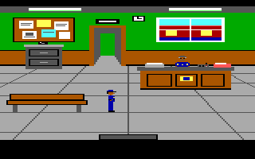 | 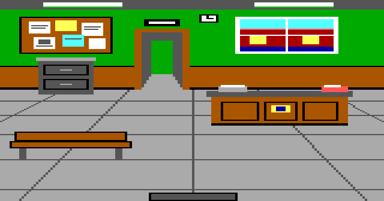 |  | 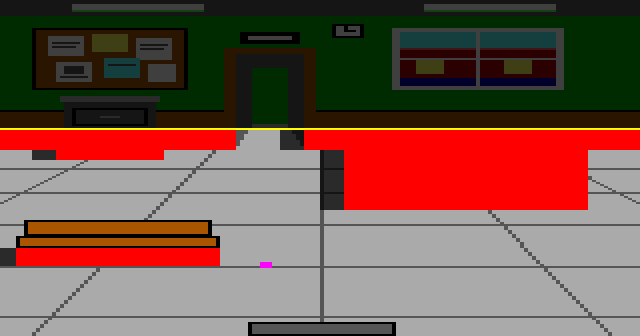 |
| claude-opus-5-5 medium | 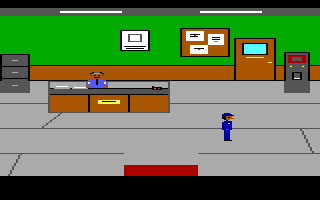 | 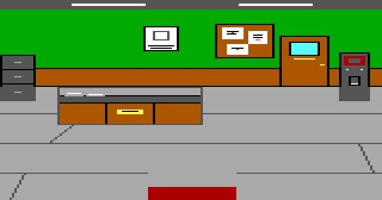 | 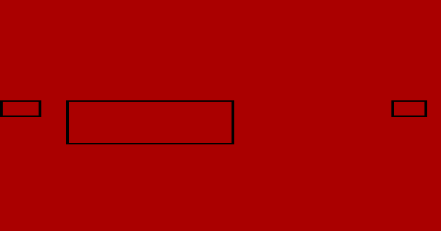 |  |
| gpt-6-astra medium | 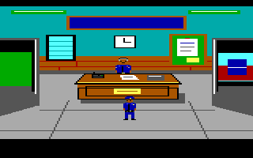 |  |  | 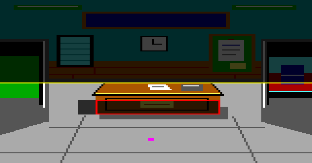 |
| gpt-6-luna medium | 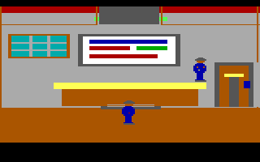 |  |  | 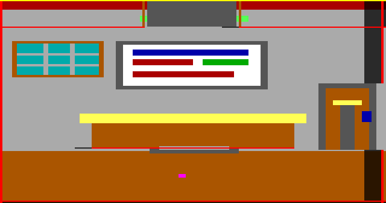 |
| gpt-6-sol medium | 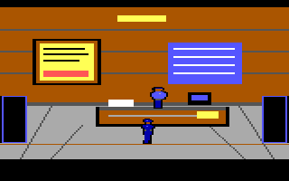 | 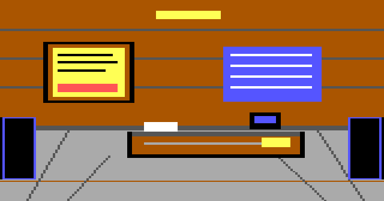 |  |  |

### Reading (auto-generated, facts only)

- Cost spread: gpt-6-luna medium $0.042 to claude-opus-5-5 high $3.244 (78x).
- Most distinct said() patterns: claude-opus-5-5 medium 96, claude-opus-5-5 high 68, gpt-6-astra medium 48, gpt-6-sol medium 31, gpt-6-luna medium 18.
- Depth-drawn priority area (pri 5-15): gpt-6-astra medium 7.2%, claude-opus-5-5 high 2.7%, claude-opus-5-5 medium 0%, gpt-6-luna medium 0%, gpt-6-sol medium 0%.
- All runs passed the harness playtest: yes.

### Reading (hand-written; JUDGMENT unless a number is quoted from the tables)

Facts (verified from the files):

- All five lanes passed the harness playtest with one start-room picture and logic, and wrote no sound of their own. Every lane named Sergeant Prakash and Dana Reyes, put the badge and radio in OBJECT, and awarded the +10 for receiving the assignment.
- Only Opus high and Astra painted depth bands in the precinct (priority 12 and 10), so the officer can pass behind the desk. Opus medium, Sol and Luna drew the room flat at priority 4.
- Luna again set `set.horizon(0)`, and its ego view has one cel per direction, so the officer does not animate while walking.
- Opus high wrote the most room text (65 messages, 5.7k characters) and parser coverage (190 said() phrases), and the largest picture (3,992 bytes). It also cost the most ($3.24, 845 s).
- The stale `Source revision changed` failure recurs here (Opus high 1, Opus medium 2, Astra 1): the same harness cost as in knights-trial.

Judgment (single run per lane):

- Richest: Opus high. The precinct reads as a place (board, window, desk, bench, cabinet), with depth, and the parser answers far more than the brief requires. On this brief, high produced noticeably more than medium for 68% more cost; on knights-trial the two were close. That keeps `high` as the app's Opus default.
- Best balance: Astra ($2.18). Fewest repairs (5), the most stored tests (5), depth, a clean front-desk composition, and full lexicon coverage in the brief checklist.
- Best value: Sol ($0.30, 185 s). Coherent and playable, but flat (no depth) and thinner in text and parser coverage.
- Luna ($0.04) completes, but its rooms are not yet authentic AGI rooms: no horizon, no depth, a static ego. It suits quick drafts, not a finished opening.

## knights-trial (5 runs)

### Cost and efficiency (measured, from report.json and events.json)

| lane | cost $ | wall s | turns | tool calls | repair turns | failures (by kind) | input tok (cached %) | output tok | authored res. | $/res. | playtest |
| --- | --- | --- | --- | --- | --- | --- | --- | --- | --- | --- | --- |
| claude-opus-5-5 high | 2.945 | 782 | 44 | 54 | 10 | 10 (invalid-args 2, dictionary 1, assembler 3, stale-revision 1, playtest-walk 1, future-room-exit 2) | 4.03M (97.2%) | 80.2k | 7 | 0.421 | passed |
| claude-opus-5-5 medium | 2.406 | 647 | 38 | 46 | 9 | 9 (invalid-args 1, dictionary 1, assembler 1, stale-revision 1, playtest-input 1, playtest-walk 2, future-room-exit 2) | 2.84M (95.9%) | 63.9k | 7 | 0.344 | passed |
| gpt-6-astra medium | 1.875 | 363 | 18 | 34 | 3 | 4 (stale-revision 2, future-room-exit 2) | 0.53M (91.2%) | 16.1k | 6 | 0.312 | passed |
| gpt-6-luna medium | 0.028 | 288 | 34 | 52 | 10 | 10 (view 2, picture/scene 1, playtest-input 2, playtest-walk 3, future-room-exit 1, playtest-expect 1) | 1.18M (95.6%) | 20.9k | 5 | 0.006 | passed |
| gpt-6-sol medium | 0.31 | 202 | 16 | 31 | 5 | 7 (playtest-walk 3, future-room-exit 2, stale-revision 1, playtest-expect 1) | 0.46M (91.5%) | 12.9k | 7 | 0.044 | passed |

### Content richness (measured from the generated resources)

| lane | room code B | room msgs (chars) | said (distinct / groups) | vocab words/groups | cmds used (room) | room flags/vars | OBJECT items | exits from start | score awards (max) | death calls | anim. objs | views (loops x cels) | ego 4-dir walk | sounds (notes, s) | tests |
| --- | --- | --- | --- | --- | --- | --- | --- | --- | --- | --- | --- | --- | --- | --- | --- |
| claude-opus-5-5 high | 1394 | 37 (3106) | 100 (97 / 30) | 114/45 | 36 | 6/12 | 6 | 2,3 | none (230) | 1 | 4 | v0:4/4/4/4 v10:1 v11:2 v12:4/4 | yes (7x30) | template only | 3 |
| claude-opus-5-5 medium | 1095 | 48 (3704) | 63 (62 / 42) | 131/56 | 41 | 7/14 | 6 | 2,3 | 10 (230) | 1 | 4 | v0:2/2/4/4 v1:4/4/4/4 v2:2/2/2/2 v3:1/1/1/1 | yes (7x29) | template only | 3 |
| gpt-6-astra medium | 754 | 30 (2474) | 39 (39 / 30) | 65/45 | 35 | 11/8 | 5 | 2,3 | 10 (230) | 1 | 5 | v1:2/2/2/2 v2:2/2/1/1 v3:2/2/2/2 | yes (10x30) | template only | 7 |
| gpt-6-luna medium | 405 | 16 (1293) | 24 (22 / 20) | 42/38 | 23 | 6/5 | 5 | 2,3 | 10 (230) | 0 | 3 | v1:1/1/1/1 v2:1 v3:1 | no (8x28) | template only | 1 |
| gpt-6-sol medium | 592 | 21 (1605) | 32 (26 / 22) | 63/39 | 24 | 7/7 | 5 | 2,3 | 10+10 (230) | 1 | 4 | v1:2/2/2/2 v2:1 v3:1 v4:2 | yes (9x30) | template only | 2 |

### Picture fidelity: priority and control (measured from the rendered start-room picture)

| lane | pic bytes (cmds) | colours | visual fill % | bands used | depth-drawn % (pri 5-15) | ctl0 % | ctl1 % | ctl2 % | ctl3 % | horizon | ego start (pri) | reachable % below horizon | reaches edges | ctl3 reachable | stands on (top colours % of reachable) |
| --- | --- | --- | --- | --- | --- | --- | --- | --- | --- | --- | --- | --- | --- | --- | --- |
| claude-opus-5-5 high | 825 (149) | 11 | 99.4 | 4,11,12 | 1.3 | 0.9 | 0 | 0 | 9.9 | 80 | 84,146 (4) | 77.8 | left,right,bottom,horizon | no | lgreen 67.6, brown 29.6 |
| claude-opus-5-5 medium | 894 (161) | 13 | 99.7 | 4,8,10,13 | 3 | 1 | 0 | 0.2 | 9.2 | 50 | 76,104 (4) | 75.1 | left,right,bottom | no | green 71.4, brown 25.1 |
| gpt-6-astra medium | 870 (163) | 12 | 99.4 | 4,13 | 0.7 | 2.3 | 0 | 0 | 0 | 75 | 75,139 (4) | 66.4 | left,right,horizon | no | green 52.6, brown 41.2 |
| gpt-6-luna medium | 3198 (663) | 10 | 100 | 4 | 0 | 0 | 0 | 0 | 0 | 0 | 80,146 (4) | 100 | left,right,bottom,horizon | no | lgreen 28.2, lblue 22.3, lgray 14.5, brown 10.6, blue 9.1, dgray 8.5, cyan 3.4 |
| gpt-6-sol medium | 411 (80) | 11 | 97.3 | 4 | 0 | 5.8 | 0 | 0 | 0 | 110 | 105,155 (4) | 81.1 | left,right,bottom,horizon | no | lgreen 67.3, brown 13, dgray 10.1, white 5.8 |

### Template and authoring behaviour (measured)

| lane | logic 0 | logic 255 | picture writes (using pri) | control cmds written | visible prose chars | top tools |
| --- | --- | --- | --- | --- | --- | --- |
| claude-opus-5-5 high | modified: msgs 18,21,22,23,24,25,26,27,28,29,30,31; +17 insns (assignn(7,230) print(21) print(30)) | identical | 1 (1) | 2 | 0 | playtest_room 8, read_words 6, read_diagnostic 5, read_logic 4 |
| claude-opus-5-5 medium | modified: msgs 17,18,20; +1 insns (assignn(7,230)) | identical | 1 (1) | 6 | 78 | playtest_room 7, read_words 5, read_diagnostic 4, write_words 4 |
| gpt-6-astra medium | modified: msgs 18; +1 insns (assignn(7,230)) | identical | 3 (1) | 2 | 521 | edit_resource_source 5, read_logic 4, playtest_room 4, read_authoring_guide 3 |
| gpt-6-luna medium | identical | identical | 2 (0) | 0 | 0 | playtest_room 11, read_command_reference 6, edit_resource_source 6, write_view 4 |
| gpt-6-sol medium | modified: msgs 18; +1 insns (assignn(7,230)) | identical | 2 (2) | 2 | 0 | playtest_room 8, write_view 4, read_logic 3, read_authoring_guide 2 |

### Brief checklist (HEURISTIC keyword/structure checks against the brief's starting room; not a quality judgment)

| check | claude-opus-5-5 high | claude-opus-5-5 medium | gpt-6-astra medium | gpt-6-luna medium | gpt-6-sol medium |
| --- | --- | --- | --- | --- | --- |
| royal notice (message) | Y | Y | Y | Y | Y |
| notice readable (said read/look notice) | Y | Y | Y | Y | Y |
| bread takeable (said + OBJECT) | Y | Y | Y | Y | Y |
| lit lantern (OBJECT) | Y | Y | Y | Y | Y |
| alligator in moat (message) | Y | Y | Y | Y | Y |
| swimming warned then fatal (call 255) | Y | Y | Y | - | Y |
| hall/drawbridge mentioned | Y | Y | Y | Y | Y |
| meadow mentioned | Y | Y | Y | Y | Y |
| >=2 exits (hall + meadow) | Y | Y | Y | Y | Y |
| accept errand +10 | - | Y | Y | Y | Y |
| King Brannoc named | Y | Y | Y | Y | Y |
| Wenna/Thornwall named | Y | Y | Y | Y | Y |
| ego red/brown (tunic, hair) | Y | Y | Y | Y | Y |
| palette: green + blue + gray | Y | Y | Y | Y | Y |
| lexicon verbs in said() | 6/7 | 7/7 | 7/7 | 6/7 | 6/7 |
| lexicon nouns in said() | 8/8 | 8/8 | 8/8 | 8/8 | 5/8 |
| score | 13/14 | 14/14 | 14/14 | 13/14 | 14/14 |

### Representative tool failures (verbatim, truncated)

- claude-opus-5-5 high `write_logic_source` [assembler]: Assembler error in logic 1: AssemblerError: 168:30: byte value out of range 0..255. Use read_command_reference for the active profile's exact signatures and semantics. Candidates b
- claude-opus-5-5 high `write_words` [dictionary]: Dictionary compilation error: Error: Invalid vocabulary '0:at/to/with/in/into/on/the/a/an/under': use ASCII words or phrases starting with a letter; punctuation is not silently rem
- claude-opus-5-5 medium `write_logic_source` [assembler]: Assembler error in logic 1: AssemblerError: 91:3: unknown action 'object.on.water' or action not available in profile 2.936 (check spelling and the selected profile). Use read_comm
- claude-opus-5-5 medium `write_words` [dictionary]: Dictionary compilation error: Error: Invalid vocabulary '0/a/an/the/to/at/with/in/on/into/of/some/my/this/that/from': use ASCII words or phrases starting with a letter; punctuation
- gpt-6-astra medium `edit_resource_source` [stale-revision]: Error: Source revision changed. Read the current source before editing; its text, dictionary, profile, or named bindings may have drifted.
- gpt-6-luna medium `write_view` [view]: Invalid facings spec: Error: right must contain 1..15 cels.
- gpt-6-luna medium `write_scene` [picture/scene]: Scene was not written: Error: Shape 11 x1 must be null for line.
- gpt-6-sol medium `playtest_room` [playtest-walk]: steps[0]: walkTo did not reach its goal: needs_input (A modal or suspended interaction needs explicit host input.).
- gpt-6-sol medium `edit_resource_source` [stale-revision]: Error: Source revision changed. Read the current source before editing; its text, dictionary, profile, or named bindings may have drifted.

### Images

| lane | first frame | visual | priority (EGA palette) | walk (dimmed = unreachable; red ctl0, orange ctl1, green ctl2, blue ctl3, yellow horizon, magenta ego start) |
| --- | --- | --- | --- | --- |
| claude-opus-5-5 high | 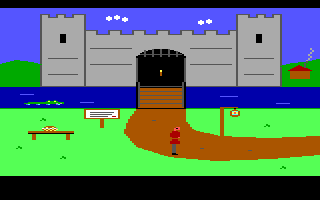 | 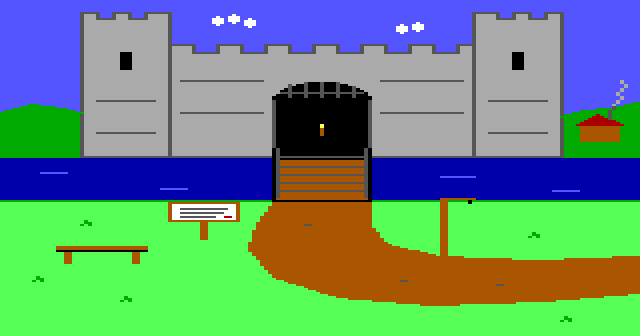 | 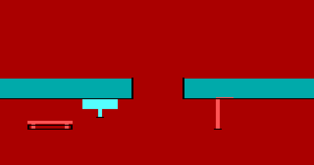 | 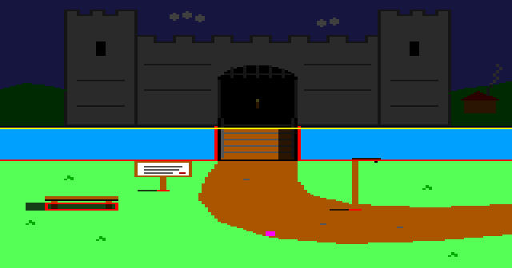 |
| claude-opus-5-5 medium | 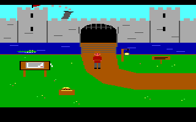 | 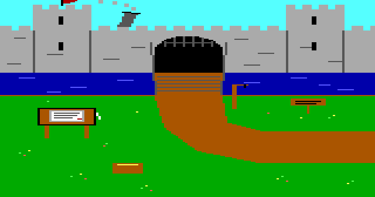 | 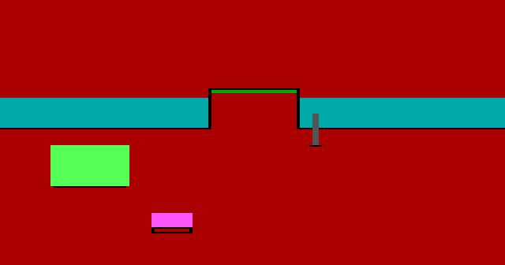 | 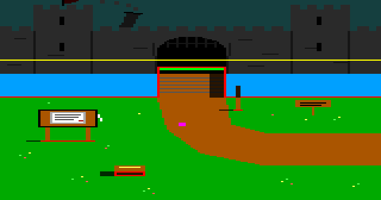 |
| gpt-6-astra medium | 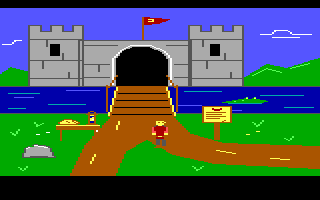 | 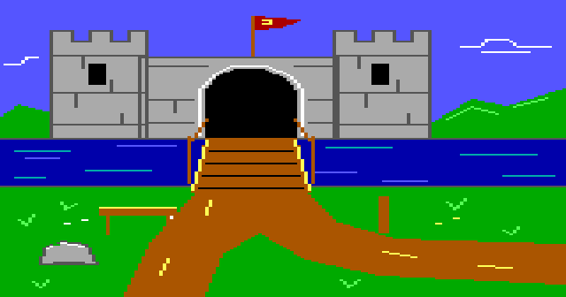 | 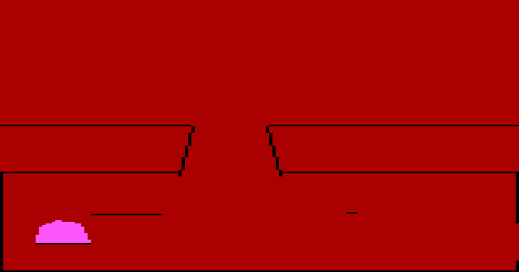 | 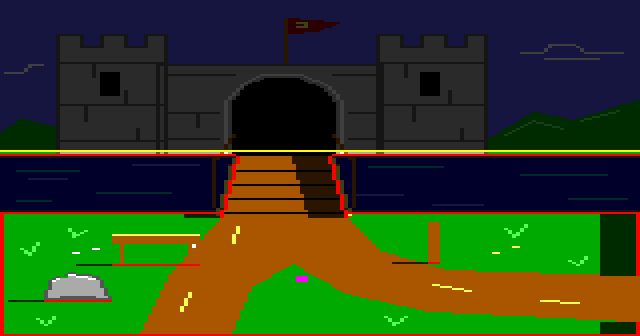 |
| gpt-6-luna medium | 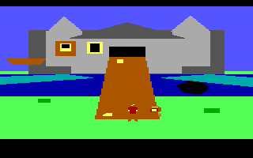 |  |  | 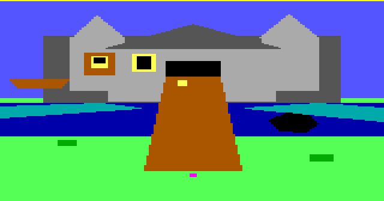 |
| gpt-6-sol medium | 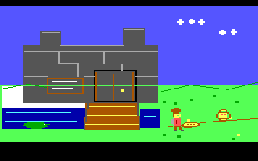 | 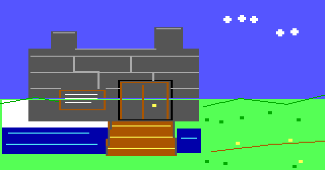 |  | 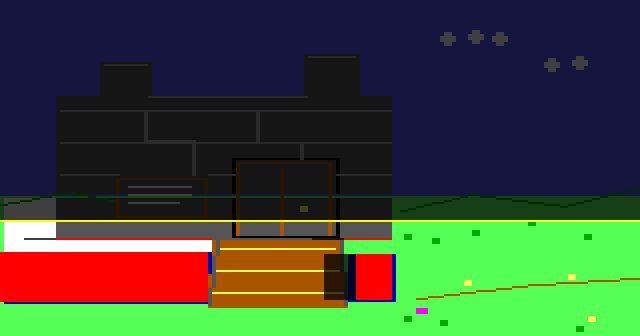 |

### Reading (auto-generated, facts only)

- Cost spread: gpt-6-luna medium $0.028 to claude-opus-5-5 high $2.945 (104x).
- Most distinct said() patterns: claude-opus-5-5 high 97, claude-opus-5-5 medium 62, gpt-6-astra medium 39, gpt-6-sol medium 26, gpt-6-luna medium 22.
- Depth-drawn priority area (pri 5-15): claude-opus-5-5 medium 3%, claude-opus-5-5 high 1.3%, gpt-6-astra medium 0.7%, gpt-6-luna medium 0%, gpt-6-sol medium 0%.
- All runs passed the harness playtest: yes.

### Reading (hand-written; JUDGMENT unless a number is quoted from the tables)

Facts (verified from the files):

- Every lane passed the harness playtest, used exactly one picture and one start-room logic, and wrote no sound (the only sound is the template death sound 255). Logic 255 is byte-identical to the template in all five runs. Logic 0 was extended only by Opus high (+17 instructions, 11 new global parser replies); the others changed the About text and set max score 230; Luna left it untouched.
- Luna's room has `set.horizon(0)`, no control lines and no priority bands. The flood fill from the ego start covers 100% of the screen, including light-blue/blue water (31% of reachable cells) and gray castle wall (23%). Its ego view has 4 loops of 1 cel each, so Wenna does not animate while walking. The room has no alligator sprite and no swim/death handler.
- Sol drew barriers over the moat but no depth bands; 10% of reachable cells are castle-wall gray below its horizon (110), and 2.7% of the picture is left unpainted white.
- Only Opus (both efforts) and Astra painted depth bands for props (bench, notice, rock), so Wenna can pass behind them. Astra stored a test that asserts this ("stone_walk_behind_then_in_front").
- Opus high awarded no points in the opening room. The errand is accepted in the hall, which the brief allows. The checklist row is a heuristic, not a defect.
- Four of five lanes hit the same `Source revision changed` failure on logic 0 (expectedRevision `3088-905c0d2a`). The revision taken at the first read goes stale once the model writes WORDS.TOK. This is a harness cost that every model pays, not a model weakness.

Judgment (single run per lane, one brief):

- Best value: Sol ($0.31, 202 s). It produced a coherent, playable gate room with sensible barriers, but with thinner parser coverage (26 distinct said patterns) and no depth.
- Best balance: Astra ($1.87). It had the fewest failures (4, all harness or expected), the most tests (7), depth and barrier lines, and a clean first frame.
- Richest content: Opus high (97 distinct said patterns, 3.1k chars of room text, 4-cel walk cycle). It also cost the most ($2.95, 782 s, 10 repair turns). Opus medium was about as rich (62 patterns, 3.7k chars) for 18% less.
- Luna costs almost nothing ($0.028) but falls short on authenticity: no horizon, no control or priority, a static ego and no moat death. It needs a stronger picture/priority prompt or validator before it is usable.
