# Genesis quality/cost matrix

Source: `evals/benchmarks/genesis/1.0.0/runs`. One row per completed run (report.json + resources). Regenerate with `npm run eval:matrix -- <results-dir> <out-dir>`.
Measured columns come from report.json, events.json, transcript.json and the AGI files (parsed with the repo's own container/logic/picture/view/sound code). The brief checklist is a keyword heuristic. Judgment lives only in the optional hand-written `reading-<case>.md`.

Definitions: *room code B* = bytecode bytes of room logics (excludes logic 0 and called logics like 255). *said (distinct / groups)* = said() calls in room logics (distinct word-id patterns / distinct word groups). *cmds used* = distinct AGI actions + tests in room logics. *depth-drawn %* = picture cells whose priority is 5..15 (4 is the unpainted default). *ctlN %* = share of the 160x168 plane holding control value N (0 barrier, 1 conditional barrier, 2 trigger, 3 water). *reachable %* = flood fill from the ego start over footprints (ego cel width) that avoid control 0/1, rows at or below the horizon. *authored res.* = resources not byte-identical to the base template.

## badge-of-millhaven (5 runs)

### Cost and efficiency (measured, from report.json and events.json)

| lane | cost $ | wall s | turns | tool calls | repair turns | failures (by kind) | input tok (cached %) | output tok | authored res. | $/res. | playtest |
| --- | --- | --- | --- | --- | --- | --- | --- | --- | --- | --- | --- |
| claude-opus-5-5 high | 2.015 | 608 | 23 | 32 | 5 | 5 (invalid-args 1, stale-revision 1, playtest-input 1, playtest-walk 2) | 1.73M (95.2%) | 63.4k | 6 | 0.336 | passed |
| claude-opus-5-5 medium | 1.664 | 457 | 22 | 31 | 5 | 5 (invalid-args 1, stale-revision 1, playtest-walk 3) | 1.51M (93.8%) | 45.8k | 7 | 0.238 | passed |
| gpt-6-astra medium | 1.804 | 394 | 17 | 37 | 2 | 2 (other 1, stale-revision 1) | 0.51M (91.1%) | 15.3k | 7 | 0.258 | passed |
| gpt-6-luna medium | 0.026 | 265 | 28 | 37 | 3 | 3 (picture/scene 1, stale-revision 1, playtest-walk 1) | 0.94M (94.6%) | 21.8k | 4 | 0.007 | passed |
| gpt-6-sol medium | 0.312 | 200 | 22 | 34 | 5 | 5 (dictionary 1, view 1, playtest-walk 1, playtest-expect 2) | 0.57M (93.6%) | 11.4k | 4 | 0.078 | passed |

### Content richness (measured from the generated resources)

| lane | room code B | room msgs (chars) | said (distinct / groups) | vocab words/groups | cmds used (room) | room flags/vars | OBJECT items | exits from start | score awards (max) | death calls | anim. objs | views (loops x cels) | ego 4-dir walk | sounds (notes, s) | tests |
| --- | --- | --- | --- | --- | --- | --- | --- | --- | --- | --- | --- | --- | --- | --- | --- |
| claude-opus-5-5 high | 941 | 44 (4606) | 48 (46 / 27) | 174/56 | 36 | 12/8 | 8 | 2,3 | 10+50 (215) | 0 | 3 | v0:2/2/4/4 v1:2 v2:4 | yes (8x30) | template only | 3 |
| claude-opus-5-5 medium | 991 | 40 (3632) | 65 (64 / 41) | 122/54 | 28 | 8/5 | 8 | 2,3 | 10 (215) | 0 | 4 | v1:2/2/4/4 v2:1 v3:4 v4:1 | yes (7x30) | template only | 3 |
| gpt-6-astra medium | 834 | 31 (3580) | 56 (55 / 28) | 64/42 | 32 | 5/7 | 5 | 2,3 | 10 (215) | 0 | 4 | v1:2/2/2/2 v2:1/1/1/1 v3:1 v4:3 | yes (9x30) | template only | 7 |
| gpt-6-luna medium | 266 | 4 (716) | 15 (9 / 10) | 51/32 | 28 | 3/10 | 2 | 2,3 | 10 (-) | 0 | 1 | v1:2/2/2/2 | yes (8x28) | template only | 1 |
| gpt-6-sol medium | 653 | 24 (2437) | 42 (37 / 21) | 76/43 | 25 | 9/7 | 6 | 3,2 | 10+50 (215) | 0 | 2 | v1:2/2/2/2 v2:1/1/1/1 | yes (8x28) | template only | 2 |

### Picture fidelity: priority and control (measured from the rendered start-room picture)

| lane | pic bytes (cmds) | colours | visual fill % | bands used | depth-drawn % (pri 5-15) | ctl0 % | ctl1 % | ctl2 % | ctl3 % | horizon | ego start (pri) | reachable % below horizon | reaches edges | ctl3 reachable | stands on (top colours % of reachable) |
| --- | --- | --- | --- | --- | --- | --- | --- | --- | --- | --- | --- | --- | --- | --- | --- |
| claude-opus-5-5 high | 694 (139) | 12 | 98.6 | 4 | 0 | 5.5 | 0 | 0.5 | 0 | 95 | 76,132 (4) | 86.8 | left,right,bottom,horizon | no | lgray 91, dgray 7.5 |
| claude-opus-5-5 medium | 615 (107) | 10 | 99.1 | 4,10,14 | 7.3 | 0.4 | 0 | 0 | 0 | 97 | 76,140 (4) | 89.9 | left,right,bottom,horizon | no | lgray 89.9, dgray 5.8 |
| gpt-6-astra medium | 778 (159) | 12 | 98.2 | 4,11 | 6.3 | 0.7 | 0 | 0 | 0 | 96 | 77,142 (4) | 98.1 | left,right,bottom,horizon | no | lgray 81.2, blue 8.9, dgray 4.6 |
| gpt-6-luna medium | 3180 (679) | 10 | 99.9 | 4,7,8 | 22.3 | 1.7 | 0 | 0 | 0 | 50 | 47,148 (4) | 84.2 | left,right,bottom,horizon | no | brown 57.9, lgreen 28.2, dgray 4.7 |
| gpt-6-sol medium | 482 (90) | 11 | 98.5 | 4,11 | 0.3 | 6.2 | 0 | 0 | 0 | 100 | 78,152 (4) | 83.2 | left,right,bottom,horizon | no | lgray 73.4, dgray 15, brown 3.6, blue 3 |

### Template and authoring behaviour (measured)

| lane | logic 0 | logic 255 | picture writes (using pri) | control cmds written | visible prose chars | top tools |
| --- | --- | --- | --- | --- | --- | --- |
| claude-opus-5-5 high | modified: msgs 18,21,22,23,24,25,26,27,28,29,30,31,32,33,34,35,36,37,38,39,40,41,42; +30 insns (assignn(7,215) print(21) print(22)) | identical | 1 (1) | 2 | 0 | read_logic 5, playtest_room 4, update_world 3, write_view 3 |
| claude-opus-5-5 medium | modified: msgs 17,18; +1 insns (assignn(7,215)) | identical | 3 (2) | 2 | 0 | write_view 4, edit_resource_source 4, playtest_room 4, read_logic 3 |
| gpt-6-astra medium | modified: msgs 18; +1 insns (assignn(7,215)) | identical | 3 (2) | 2 | 489 | edit_resource_source 5, read_authoring_guide 4, write_view 4, read_logic 3 |
| gpt-6-luna medium | modified: msgs 20; +0 insns () | identical | 4 (4) | 2 | 0 | playtest_room 7, read_logic 4, edit_resource_source 4, inspect_world_bible 3 |
| gpt-6-sol medium | identical | identical | 2 (1) | 1 | 0 | playtest_room 8, read_command_reference 5, edit_resource_source 3, read_logic 2 |

### Brief checklist (HEURISTIC keyword/structure checks against the brief's starting room; not a quality judgment)

| check | claude-opus-5-5 high | claude-opus-5-5 medium | gpt-6-astra medium | gpt-6-luna medium | gpt-6-sol medium |
| --- | --- | --- | --- | --- | --- |
| precinct / front desk (message) | Y | Y | Y | Y | Y |
| Sergeant Prakash named | Y | Y | Y | Y | Y |
| talk to Prakash (said talk) | Y | Y | Y | Y | Y |
| badge (OBJECT) | Y | Y | Y | Y | Y |
| radio (OBJECT) | Y | Y | Y | Y | Y |
| board readable (said board) | Y | Y | Y | Y | Y |
| lead: driver/pharmacy mentioned | Y | Y | Y | Y | Y |
| receive assignment +10 | Y | Y | Y | Y | Y |
| >=1 exit | Y | Y | Y | Y | Y |
| Dana/Reyes named | Y | Y | Y | - | Y |
| ego navy/blue uniform | Y | Y | Y | Y | Y |
| palette: red brick + blue + green | Y | - | Y | Y | Y |
| lexicon verbs in said() | 7/8 | 8/8 | 8/8 | 6/8 | 8/8 |
| lexicon nouns in said() | 2/8 | 8/8 | 8/8 | 1/8 | 4/8 |
| score | 12/12 | 11/12 | 12/12 | 11/12 | 12/12 |

### Representative tool failures (verbatim, truncated)

- claude-opus-5-5 high `update_world` [invalid-args]: Invalid arguments for update_world; nothing was changed. rooms[2].name is not a known field (fields: num, title, description, exits).
- claude-opus-5-5 high `playtest_room` [playtest-walk]: steps[1]: walkTo did not reach its goal: needs_input (A message window is open; add an enter step to dismiss it before walking.).
- claude-opus-5-5 medium `update_world` [invalid-args]: Invalid arguments for update_world; nothing was changed. rooms[2].name is not a known field (fields: num, title, description, exits).
- claude-opus-5-5 medium `playtest_room` [playtest-walk]: steps[1]: walkTo did not reach its goal: movement_control_unavailable (Ego is not animated and updating (animate.obj(0), draw(0), start.update(0)), so it cannot walk.).
- gpt-6-astra medium `edit_resource_source` [stale-revision]: Error: Source revision changed. Read the current source before editing; its text, dictionary, profile, or named bindings may have drifted.
- gpt-6-luna medium `write_scene` [picture/scene]: Scene was not written: Error: Shape 1 x1 must be null for line.
- gpt-6-luna medium `playtest_room` [playtest-walk]: steps[0]: walkTo did not reach its goal: unreachable_under_current_model (No route in the current static model.).
- gpt-6-sol medium `write_words` [dictionary]: Dictionary compilation error: Error: Invalid vocabulary 'break in/break-in': use ASCII words or phrases starting with a letter; punctuation is not silently removed.
- gpt-6-sol medium `playtest_room` [view]: Room initialization did not draw an ego with a valid cel.

### Images

| lane | first frame | visual | priority (EGA palette) | walk (dimmed = unreachable; red ctl0, orange ctl1, green ctl2, blue ctl3, yellow horizon, magenta ego start) |
| --- | --- | --- | --- | --- |
| claude-opus-5-5 high | 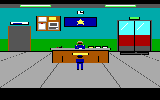 |  |  | 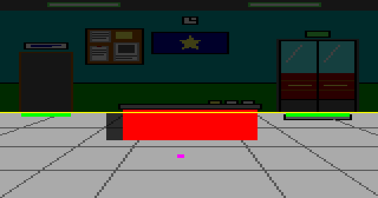 |
| claude-opus-5-5 medium | 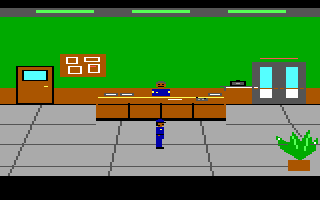 |  |  | 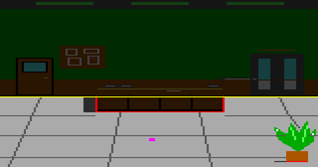 |
| gpt-6-astra medium |  | 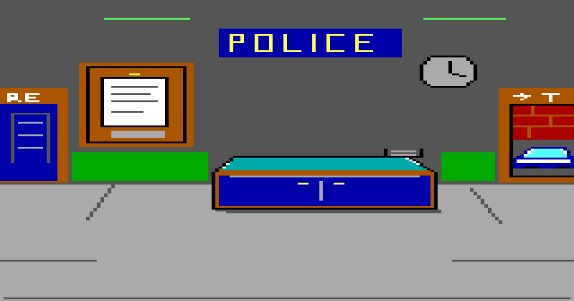 |  | 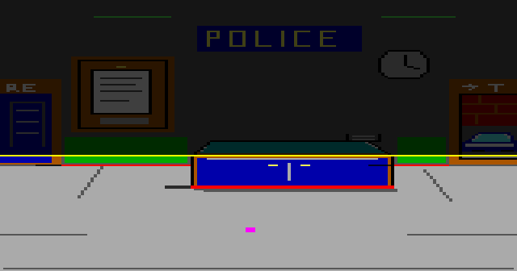 |
| gpt-6-luna medium | 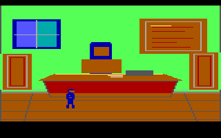 | 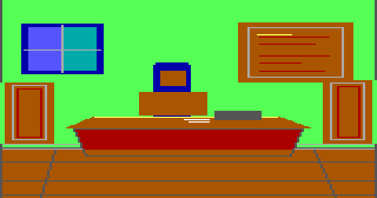 |  | 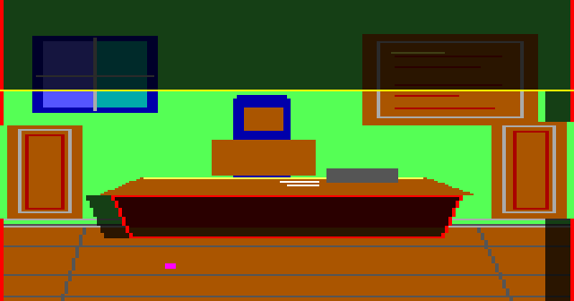 |
| gpt-6-sol medium | 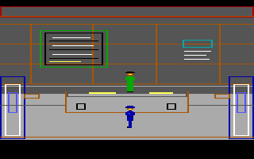 | 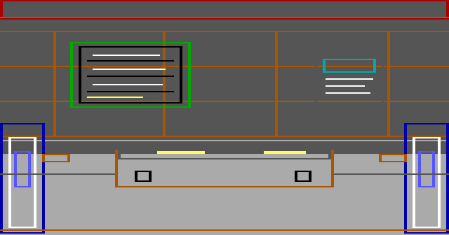 |  | 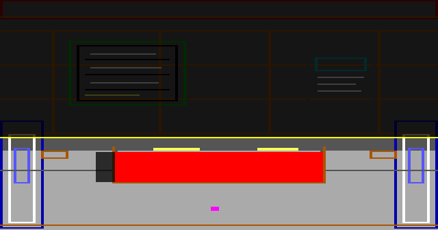 |

### Reading (auto-generated, facts only)

- Cost spread: gpt-6-luna medium $0.026 to claude-opus-5-5 high $2.015 (77x).
- Most distinct said() patterns: claude-opus-5-5 medium 64, gpt-6-astra medium 55, claude-opus-5-5 high 46, gpt-6-sol medium 37, gpt-6-luna medium 9.
- Depth-drawn priority area (pri 5-15): gpt-6-luna medium 22.3%, claude-opus-5-5 medium 7.3%, gpt-6-astra medium 6.3%, gpt-6-sol medium 0.3%, claude-opus-5-5 high 0%.
- All runs passed the harness playtest: yes.

### Reading (hand-written; JUDGMENT unless a number is quoted from the tables)

Facts, against the [baseline](../../1.0.0-baseline/matrix/matrix.md):

- Every lane passed. Tool failures fell from 48 to 20: Luna from 15 to 3, Opus high from 9 to 5, Astra from 5 to 2.
- Opus high needed 23 model turns instead of 46 and cost $2.01 instead of $3.24. It also wrote less this time: 48 said() phrases against 190. One run per lane cannot separate that from variance.
- Luna now sets a horizon (50), draws depth bands (22% of the picture) and animates ego. Opus medium and Astra draw depth too; Opus high stays flat and Sol nearly so (0.3%).
- Opus still named plan rooms `name`, which accounts for its remaining invalid-args failures. That is fixed after this run; see the README.

Judgment (single run per lane):

- Best balance: Astra ($1.80): the fewest failures (2), the most tests (7) and depth.
- Opus medium ($1.66) builds a rich room with depth for less than Astra.
- Sol ($0.31) remains the value pick. Luna ($0.03) is plain but now plays like an AGI room.

## knights-trial (5 runs)

### Cost and efficiency (measured, from report.json and events.json)

| lane | cost $ | wall s | turns | tool calls | repair turns | failures (by kind) | input tok (cached %) | output tok | authored res. | $/res. | playtest |
| --- | --- | --- | --- | --- | --- | --- | --- | --- | --- | --- | --- |
| claude-opus-5-5 high | 3.178 | 861 | 38 | 46 | 6 | 6 (invalid-args 1, stale-revision 1, playtest-walk 2, other 1, playtest-expect 1) | 3.79M (96.2%) | 86.1k | 8 | 0.397 | passed |
| claude-opus-5-5 medium | 2.264 | 601 | 30 | 39 | 7 | 9 (invalid-args 1, assembler 1, stale-revision 1, playtest-walk 3, playtest-expect 3) | 2.3M (95.1%) | 63.1k | 7 | 0.323 | passed |
| gpt-6-astra medium | 2.593 | 496 | 22 | 44 | 4 | 4 (other 1, view 2, stale-revision 1) | 0.82M (92.6%) | 21.4k | 8 | 0.324 | passed |
| gpt-6-luna medium | 0.055 | 536 | 39 | 74 | 7 | 8 (view 1, picture/scene 2, playtest-input 3, playtest-walk 2) | 2.07M (95.4%) | 46.7k | 5 | 0.011 | passed |
| gpt-6-sol medium | 0.312 | 188 | 17 | 26 | 2 | 2 (playtest-walk 2) | 0.46M (92.1%) | 13.4k | 5 | 0.062 | passed |

### Content richness (measured from the generated resources)

| lane | room code B | room msgs (chars) | said (distinct / groups) | vocab words/groups | cmds used (room) | room flags/vars | OBJECT items | exits from start | score awards (max) | death calls | anim. objs | views (loops x cels) | ego 4-dir walk | sounds (notes, s) | tests |
| --- | --- | --- | --- | --- | --- | --- | --- | --- | --- | --- | --- | --- | --- | --- | --- |
| claude-opus-5-5 high | 1110 | 46 (3721) | 58 (58 / 40) | 148/55 | 35 | 5/12 | 8 | 2,3 | 10 (230) | 1 | 5 | v0:4/4/4/4 v1:3/3/3/3 v2:1 v3:2 v4:1 | yes (9x30) | template only | 3 |
| claude-opus-5-5 medium | 909 | 39 (3237) | 45 (41 / 30) | 142/56 | 32 | 7/8 | 7 | 2,3 | none (230) | 1 | 6 | v1:4/4/4/4 v2:3/3 v3:1/1/2 v4:3 | yes (7x27) | template only | 3 |
| gpt-6-astra medium | 991 | 40 (3911) | 49 (49 / 35) | 71/46 | 41 | 11/11 | 5 | 2,3 | 10 (230) | 1 | 5 | v1:2/2/2/2 v2:1/1/1/1 v3:2/2/2/2 v4:2/2/2/2 v5:1/1/1/1 | yes (9x30) | template only | 11 |
| gpt-6-luna medium | 434 | 18 (1455) | 22 (21 / 16) | 50/34 | 24 | 6/5 | 2 | 2,3 | 10 (230) | 0 | 3 | v1:2/2/2/2 v2:1/1 v3:1 | yes (10x24) | template only | 1 |
| gpt-6-sol medium | 613 | 30 (2189) | 27 (27 / 22) | 69/39 | 23 | 8/6 | 5 | 3,2 | none (230) | 0 | 3 | v1:2/2/2/2 v2:1 v3:1 | yes (9x29) | template only | 3 |

### Picture fidelity: priority and control (measured from the rendered start-room picture)

| lane | pic bytes (cmds) | colours | visual fill % | bands used | depth-drawn % (pri 5-15) | ctl0 % | ctl1 % | ctl2 % | ctl3 % | horizon | ego start (pri) | reachable % below horizon | reaches edges | ctl3 reachable | stands on (top colours % of reachable) |
| --- | --- | --- | --- | --- | --- | --- | --- | --- | --- | --- | --- | --- | --- | --- | --- |
| claude-opus-5-5 high | 1099 (193) | 12 | 99.3 | 4,10,11 | 2.1 | 1.7 | 0 | 0 | 10.9 | 62 | 76,132 (4) | 59.5 | right,horizon | no | lgreen 62.1, brown 33.5 |
| claude-opus-5-5 medium | 886 (142) | 11 | 100 | 4,11,12,13,14 | 12.5 | 1.7 | 0 | 0 | 0 | 64 | 60,128 (4) | 63 | right,horizon | no | lgreen 72.3, brown 22.4 |
| gpt-6-astra medium | 1193 (204) | 13 | 99.3 | 4,14 | 2.9 | 2.6 | 0 | 0 | 9.6 | 64 | 76,143 (4) | 74.8 | left,right,bottom,horizon | no | green 51, brown 30, lgray 8.7, lgreen 5 |
| gpt-6-luna medium | 3859 (801) | 10 | 100 | 4 | 0 | 1 | 0 | 0 | 0 | 89 | 30,151 (4) | 96.3 | left,right,bottom,horizon | no | green 55.6, brown 22.4, blue 13.4, lgray 4.3 |
| gpt-6-sol medium | 4190 (862) | 12 | 99.2 | 4 | 0 | 0.5 | 0 | 0 | 10.9 | 65 | 71,148 (4) | 99.1 | left,right,bottom,horizon | yes | brown 35.5, lgreen 20.9, blue 13.9, lgray 8, green 6.7, lcyan 5.8, dgray 4.3 |

### Template and authoring behaviour (measured)

| lane | logic 0 | logic 255 | picture writes (using pri) | control cmds written | visible prose chars | top tools |
| --- | --- | --- | --- | --- | --- | --- |
| claude-opus-5-5 high | modified: msgs 17,18,21,22,23,24,25,26,27,28,29,30,31,32,33,34,35,36; +23 insns (assignn(7,230) status() print(21)) | identical | 1 (1) | 2 | 81 | playtest_room 10, read_diagnostic 5, write_view 5, edit_resource_source 5 |
| claude-opus-5-5 medium | modified: msgs 18,21,22,23,24,25,26,27,28,29,30,31,32,33,34,35,36,37,38,39,40,41; +29 insns (assignn(7,230) status() set(30)) | identical | 1 (1) | 1 | 0 | playtest_room 12, read_logic 5, write_view 4, edit_resource_source 3 |
| gpt-6-astra medium | modified: msgs 18; +1 insns (assignn(7,230)) | identical | 2 (1) | 3 | 416 | write_view 7, read_logic 5, edit_resource_source 5, read_authoring_guide 3 |
| gpt-6-luna medium | identical | identical | 5 (1) | 1 | 0 | playtest_room 14, read_command_reference 8, write_view 7, read_diagnostic 7 |
| gpt-6-sol medium | identical | identical | 2 (2) | 8 | 0 | playtest_room 5, read_logic 3, read_authoring_guide 3, write_view 3 |

### Brief checklist (HEURISTIC keyword/structure checks against the brief's starting room; not a quality judgment)

| check | claude-opus-5-5 high | claude-opus-5-5 medium | gpt-6-astra medium | gpt-6-luna medium | gpt-6-sol medium |
| --- | --- | --- | --- | --- | --- |
| royal notice (message) | Y | Y | Y | Y | Y |
| notice readable (said read/look notice) | Y | Y | Y | Y | Y |
| bread takeable (said + OBJECT) | Y | Y | Y | Y | Y |
| lit lantern (OBJECT) | Y | Y | Y | Y | Y |
| alligator in moat (message) | Y | Y | Y | Y | Y |
| swimming warned then fatal (call 255) | Y | Y | Y | - | - |
| hall/drawbridge mentioned | Y | Y | Y | Y | Y |
| meadow mentioned | Y | Y | Y | Y | Y |
| >=2 exits (hall + meadow) | Y | Y | Y | Y | Y |
| accept errand +10 | Y | - | Y | Y | - |
| King Brannoc named | Y | Y | Y | Y | Y |
| Wenna/Thornwall named | Y | Y | Y | Y | Y |
| ego red/brown (tunic, hair) | Y | Y | Y | Y | Y |
| palette: green + blue + gray | Y | Y | Y | Y | Y |
| lexicon verbs in said() | 6/7 | 6/7 | 7/7 | 7/7 | 7/7 |
| lexicon nouns in said() | 8/8 | 4/8 | 8/8 | 5/8 | 4/8 |
| score | 14/14 | 13/14 | 14/14 | 13/14 | 12/14 |

### Representative tool failures (verbatim, truncated)

- claude-opus-5-5 high `update_world` [invalid-args]: Invalid arguments for update_world; nothing was changed. rooms[4].name is not a known field (fields: num, title, description, exits).
- claude-opus-5-5 high `playtest_room` [playtest-walk]: steps[1]: walkTo did not reach its goal: movement_control_unavailable (Ego is not animated and updating (animate.obj(0), draw(0), start.update(0)), so it cannot walk.).
- claude-opus-5-5 medium `write_logic_source` [assembler]: Assembler error in logic 1: AssemblerError: 159:31: word 'drink' is not in the dictionary. Use read_words to inspect existing word groups, then write_words to register the missing 
- claude-opus-5-5 medium `update_world` [invalid-args]: Invalid arguments for update_world; nothing was changed. rooms[3].name is not a known field (fields: num, title, description, exits).
- gpt-6-astra medium `write_view` [view]: Invalid facings spec: Error: right cel 0 row 5 must contain only EGA hex digits 0-F.
- gpt-6-astra medium `edit_resource_source` [stale-revision]: Error: Source revision changed. Read the current source before editing; its text, dictionary, profile, or named bindings may have drifted.
- gpt-6-luna medium `write_view` [view]: Invalid facings spec: Error: right must contain 1..15 cels.
- gpt-6-luna medium `write_picture` [picture/scene]: Picture 1 was NOT updated; the source did not compile. Fix these and resend the complete source: line 77: plot: expected x,y pair, got '1' line 79: plot: expected x,y pair, got '1'
- gpt-6-sol medium `playtest_room` [playtest-walk]: steps[1]: walkTo did not reach its goal: needs_input (A message window is open; add an enter step to dismiss it before walking.).

### Images

| lane | first frame | visual | priority (EGA palette) | walk (dimmed = unreachable; red ctl0, orange ctl1, green ctl2, blue ctl3, yellow horizon, magenta ego start) |
| --- | --- | --- | --- | --- |
| claude-opus-5-5 high | 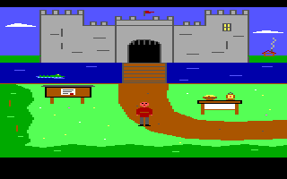 | 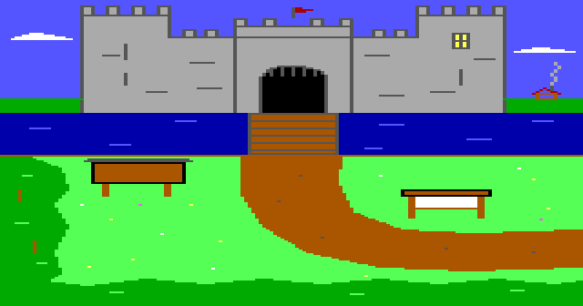 | 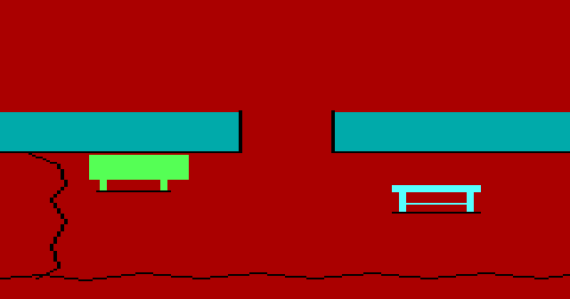 | 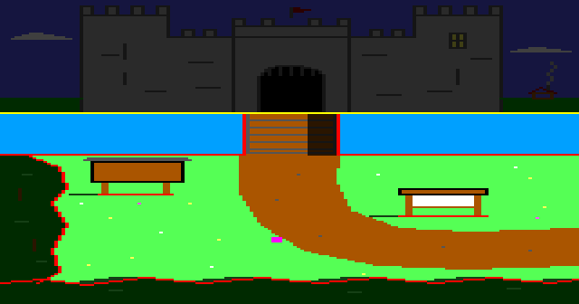 |
| claude-opus-5-5 medium | 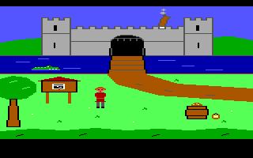 | 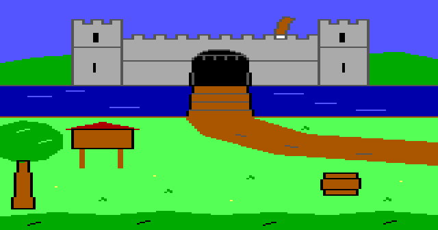 | 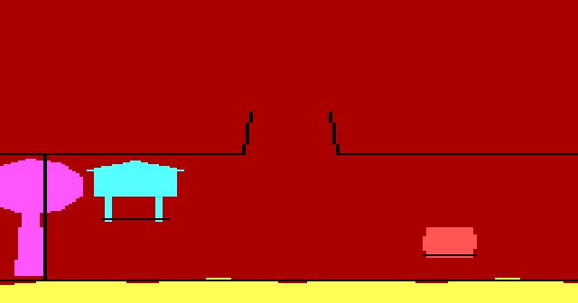 | 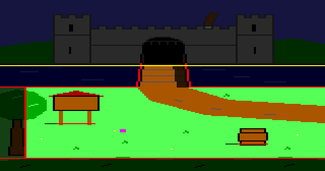 |
| gpt-6-astra medium |  |  | 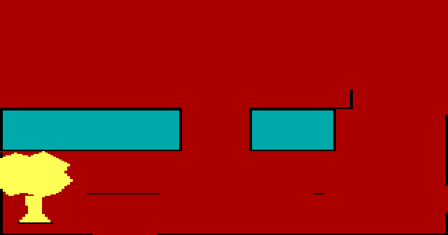 | 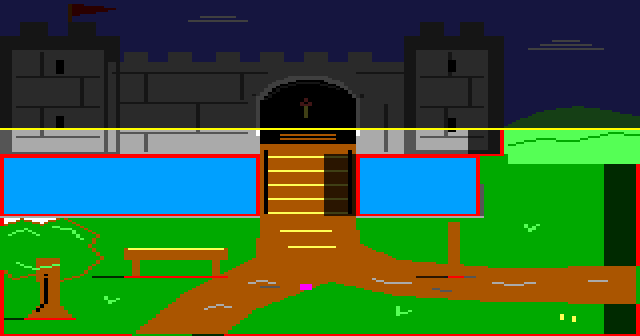 |
| gpt-6-luna medium | 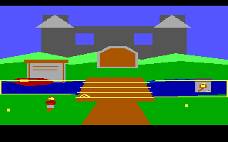 | 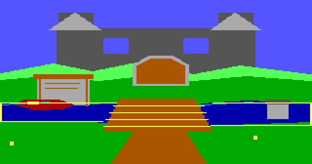 |  | 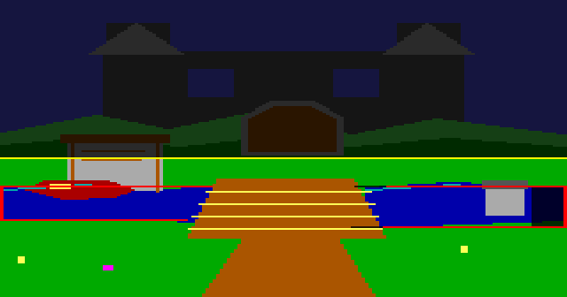 |
| gpt-6-sol medium | 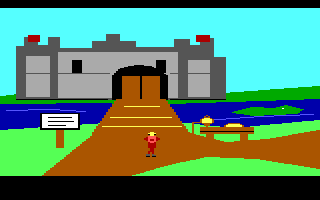 | 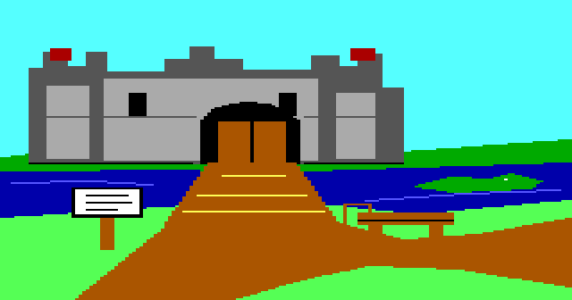 |  | 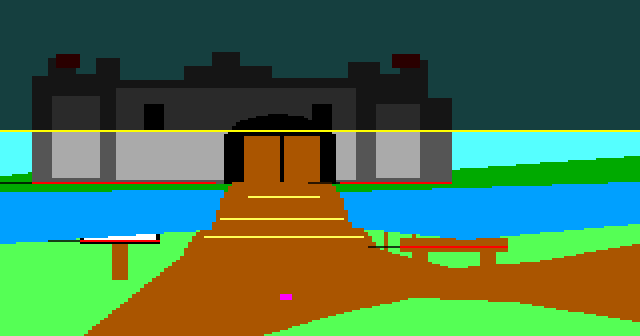 |

### Reading (auto-generated, facts only)

- Cost spread: gpt-6-luna medium $0.055 to claude-opus-5-5 high $3.178 (58x).
- Most distinct said() patterns: claude-opus-5-5 high 58, gpt-6-astra medium 49, claude-opus-5-5 medium 41, gpt-6-sol medium 27, gpt-6-luna medium 21.
- Depth-drawn priority area (pri 5-15): claude-opus-5-5 medium 12.5%, gpt-6-astra medium 2.9%, claude-opus-5-5 high 2.1%, gpt-6-luna medium 0%, gpt-6-sol medium 0%.
- All runs passed the harness playtest: yes.

### Reading (hand-written; JUDGMENT unless a number is quoted from the tables)

Facts, against the [baseline](../../1.0.0-baseline/matrix/matrix.md):

- Every lane passed. Tool failures fell from 40 to 29 across the five lanes, and Sol's from 7 to 2. No lane hit a planned-room exit failure, a shifted assembler line or a rejected 9999 said() id.
- Luna now sets a horizon (89), draws control lines and gives ego a two-cel walk in every direction. The baseline's Luna room was walkable everywhere, sky and moat included.
- Sol draws its moat as water (10.9% of the picture), and its ego can reach that water (the brief's swim-then-drown). The baseline Sol room had no water control.
- Astra stored the most tests (11) and draws both water and depth.
- The remaining stale-revision failures on logic 0 came from menu text counted as vocabulary. That is fixed after this run; see the README.

Judgment (single run per lane):

- Best balance: Astra ($2.59) and Opus medium ($2.26). Both build rich rooms with depth and barriers; only Astra also marks the moat as water.
- Best value: Sol ($0.31). It is now a coherent, controlled room, still thinner in text and without depth.
- Luna ($0.05) is now an authentic if plain room. The feedback on rooms that do not play like AGI rooms did what it was for.
